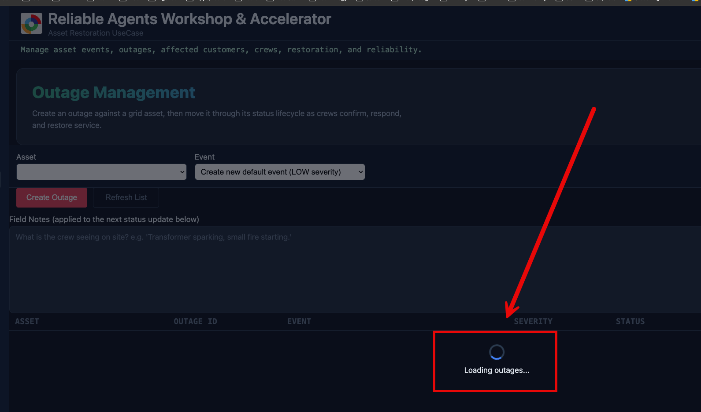

# Page Loading Overlay

## What it is

A full-panel loading overlay: a dark scrim with a spinner and a message line,
covering the content area to the right of the sidebar. One overlay element
(`#page-loading-overlay`) shared across the whole app, not one per panel.



_The overlay covering the Outages panel while assets, events, and outages load._

It is a different mechanism from the `.loading` strip used in the Command
Center chat panel. That one stays inline on purpose, because the
instrumentation panel needs to keep streaming step-by-step trace rows into
view while a chat request is in flight. The page overlay is for the opposite
case: a panel that has nothing to show yet, so covering it while its first
data fetch resolves is the right call.

## What it does

Blocks the view of a panel with a spinner and a short message (e.g. "Loading
outages...") while that panel's initial data is being fetched, then
disappears once every fetch it was covering for has resolved (success or
failure). Without it, clicking a nav link (e.g. Outages) landed on a panel
that looked frozen for several seconds while assets/events/outages loaded.

## How it works

- Markup: one `<div id="page-loading-overlay">` in
  [index.html](../../src/frontend/index.html), containing a `.spinner` and a
  `<p id="page-loading-message">`. Lives once in the DOM, outside any single
  panel, and is hidden by default via the `hidden` class.
- Styling: `.page-loading-overlay` in
  [styles.css](../../src/frontend/styles.css) is `position: fixed`, offset by
  `var(--sidebar-width)` on the left so it never covers the sidebar nav, with
  a semi-transparent dark background and a larger spinner variant than the
  inline `.loading` one.
- Behavior: `setPageLoading(visible, message)` in
  [app.js](../../src/frontend/app.js) toggles the `hidden` class and sets the
  message text. It has no knowledge of which panel is active or what it's
  loading - callers decide when to show/hide it and what to say.

## How to invoke it

Call `setPageLoading(true, "Loading <thing>...")` right before kicking off a
panel's data fetches, and `setPageLoading(false)` once they've all settled
(success or failure) via `.finally()`. Example from `showOutagesView()`:

```javascript
setPageLoading(true, "Loading outages...");
Promise.all([
  loadOutageAssets().then(() => loadOutages()),
  loadOutageEvents(),
]).finally(() => {
  setPageLoading(false);
});
```

To add it to another panel's `show*View()` function, follow the same pattern:
show it first with a panel-appropriate message, wrap the panel's loading
calls in `Promise.all(...)`, and hide it in `.finally()` so it clears even if
a fetch fails.
