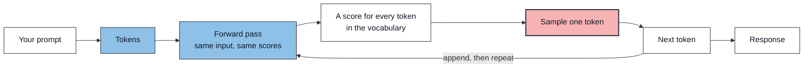

# Building Reliable Agents and Agentic Solutions

Language models are probabilistic by design. The same request can produce different outputs, and small inconsistencies compound as work moves through a multi-agent system.

Consider what happens when you submit the following database query:

```sql
SELECT COUNT(*) FROM grid_assets WHERE status = 'REPORTED';
```

You get the same number every time, as long as the data has not changed. That guarantee is so ordinary we build on it without noticing: it is why a result can be cached, a query can be tested, and two reports can be reconciled.

Ask a language model the same question twice and the data can be identical while the answers are not.

## Where the variability comes from

A language model does not look up an answer or run a decision procedure. It predicts text, one token at a time.



Each pass scores every token in the model's vocabulary - tens of thousands of candidates. A sampling step then draws one. That token is appended to the input and the loop runs again for the next one. A paragraph is that loop, several hundred times.

Three things follow.

**The variability lives in the sampling step, not in the weights.** Given identical input, the forward pass produces the same scores every time. What differs is which token gets drawn from them.

**You cannot configure your way out of it.** Hosted models are not deterministic and offer no setting that makes them so. Floating-point arithmetic is order-sensitive, and the batching and hardware scheduling behind a hosted endpoint are outside your control. Reasoning models add a second source of variance on top: they generate an internal trace before answering, variable in length and content from run to run, conditioning the final answer, and never returned to you. The part of the computation that varies most is the part you cannot inspect.

**The model is never choosing an agent, a tool, or a route.** It is emitting the tokens that spell one. There is no decision inside it to inspect or appeal to - only text that came out, which your code then has to interpret and check. That distinction is the reason this workshop exists.

## Software is built on determinism

Every practice in software engineering rests on one assumption: the same input produces the same output. That single property is what makes a unit test meaningful, a bug reproducible, a stack trace worth reading, a code review capable of catching anything, and a regression something you detect rather than something you discover later.

A language model does not offer that property - not as a defect, but as its design. The capability that lets it interpret a sentence it has never seen is the same capability that lets it answer differently the second time.

So the moment a model appears inside an application, that application contains a component its own tooling cannot reason about:

- A unit test needs an expected value. What is the expected value of "summarize this"?
- Debugging begins with reproduction. What do you do when the failure will not reproduce?
- A code review reads what the code will do. A prompt does not tell you what the model will do with it.
- A dependency change normally appears as a diff. A model can change behavior with no diff at all.

None of this depends on scale, industry, or budget. A weekend project has the same problem as a bank. What scale changes is what a failure costs and how long it takes anyone to notice.

## Probability meets production

Variability is a feature when a model drafts text for a person to review. It becomes a liability the moment that output feeds a business process.

Production systems carry expectations that predate language models and have not relaxed for them. The same question should return the same answer. An operator should be able to ask why the system did what it did. A request should reach only the data its user is entitled to see. When something goes wrong, someone has to determine which component was responsible.

The arithmetic is unforgiving. A step that is right 95 percent of the time sounds dependable. Chain five such steps and the odds that all five are right fall to about 77 percent - roughly one request in four goes wrong somewhere, and nothing in the system announces where.

## What goes wrong

The failures are rarely loud:

- **Confidently wrong answers.** A model seldom returns an error. It returns something plausible, in the same tone as a correct answer, so a wrong result and a right result look identical to the user.
- **Irreproducible behavior.** The same prompt takes a different path on Tuesday than it did on Monday. A bug you cannot reproduce is a bug you cannot fix.
- **Unattributable failures.** Seven agents ran and the answer is wrong. Which one caused it? Without a record of what each step decided, the investigation starts from nothing.
- **Failures that look like successes.** A data call fails, the error is swallowed, and the agent returns an empty result. Downstream code cannot tell "there are no outages" from "we could not check."
- **Unbounded execution.** A loop that ends only when the model says it is finished will sometimes not end, and will sometimes end too early.
- **Permissions argued rather than enforced.** A restriction written into a prompt is a request. Phrasing can talk a model past it, and nothing reports that it happened.

## The demo-to-production gap

These problems are sharpest for agentic applications that began as demos, which is most of them.

A demo runs on the happy path. It is exercised with prompts the builder chose, by someone who knows what the system can do, and its success criterion is that it answered at all. None of that survives contact with real users, who phrase things unpredictably, ask for things the system does not support, and arrive while a dependency is down.

The deeper problem is architectural. A demo earns its speed by letting the model decide everything - which tool to call, what query to run, when the work is done. That flexibility is what makes it quick to build, and it is also what leaves nowhere to put a rule later. There is no seam at which to say _this request may use these capabilities and not those_, because nothing in the design draws that line.

So when a demo misbehaves, the instinct is to improve the prompt. This application contains a real example of where that leads. An early version asked the model to generate the SQL that walks the grid hierarchy from a substation down to its meters. The model performed the joins on some calls and skipped them on others, so identical questions returned different answers from one run to the next - and it kept doing so **after** an explicit traversal rule was added to the prompt. The fix was not better wording. It was moving the traversal out of the model's hands entirely, into fixed code that returns the same topology every time.

That is the shape of the work ahead: deciding, deliberately, which judgments a model should make and which ones belong in code.

This workshop is about the engineering practices that make such a system dependable anyway. You will deploy, explore, and complete a multi-agent application that answers operational questions about electric-grid assets, outages, and crews - the kind of system where a confidently wrong answer has consequences.

## Deterministic engineering

The goal is not to make model output deterministic. Transformer-based models are probabilistic by design, and that is precisely what makes them useful for interpreting language. The goal is to wrap deterministic controls around that behavior, separating what the model **proposes** from what the application **permits**.

This workshop calls that discipline _deterministic engineering_, and you will meet it as a recurring callout in every lab, marking the specific decision that keeps a probabilistic component inside a predictable system. The division of labor is consistent:

| The model                        | The application                         |
| -------------------------------- | --------------------------------------- |
| Interprets the user's language   | Validates that interpretation           |
| Recommends which agent runs next | Decides whether that agent is permitted |
| Generates a database query       | Constrains, authorizes, and executes it |
| Claims the work is finished      | Decides when the loop actually stops    |

Read the right-hand column again. None of it asks the model to behave. Each control makes misbehavior either impossible or visible.

## Why a multi-agent architecture

A single agent holding every tool and every domain rule is simpler, and for a small tool surface it is often the right answer. As that surface grows, the model has more room to choose wrong, and there is no natural place to say "this request may use these capabilities and not those."

This application answers questions spanning assets, events, outages, crews, reliability, and weather. Those domains have different data paths, different rules, and different permissions - so the work is split across specialist agents, with a deterministic router in front of them. Each intent permits a specific set of agents, enforced by a lookup that runs before anything executes.

## Guiding principles

Seven patterns recur throughout the labs:

- **Classify unstructured user requests.** Convert user language into a clearly defined intent before routing or execution.
- **Consume typed inputs and outputs.** Pass validated objects between components instead of error-prone free-form text.
- **Require prompt templating.** Reuse prompt patterns with fixed instructions and defined variables.
- **Validate model and tool boundaries.** Enforce schemas, types, ranges, and permitted values before execution.
- **Restrict available actions.** Limit models to agents and operations permitted for the request.
- **Implement deterministic control flow.** Application code controls dispatch, stopping conditions, and failure handling.
- **Make execution observable.** Record decisions and steps throughout each operation.

## What you will build

Across the hands-on labs you will implement three of the application's reliability boundaries yourself:

- **Typed intent classification** with explicit failure handling, separating an unsupported request from a system that could not run.
- **Bounded orchestration** with an agent allow-list, deterministic dispatch, and stopping conditions the model cannot override.
- **A domain agent** that reaches data through MCP, returns typed results, and fails a step rather than returning false success.

You will also see, but not build, the surrounding boundaries: prompt templating, structured response assembly, and the read-only data path that separates agent queries from the deterministic write path.

## Workshop path

1. Read this page.
2. [Deploy and verify the application](../01-deployment/workshop-deployment.md)
3. Complete the hands-on labs:
   - [Lab 1: Application Overview](../02-hands-on-labs/01-application-overview/lab-1-guide.md)
   - [Lab 2: Intent Classification](../02-hands-on-labs/02-intent-classification/lab-2-guide.md)
   - [Lab 3: Reliable Orchestration](../02-hands-on-labs/03-reliable-orchestration/lab-3-guide.md)
   - [Lab 4: Domain Agent](../02-hands-on-labs/04-domain-agent/lab-4-guide.md)
4. [Clean up workshop resources](../03-cleanup/lab-cleanup.md)

Each implementation lab starts from a known checkpoint with one incomplete behavior. Follow the branch instructions in each lab before making changes.

## Expected outcome

By the end of the workshop you will be able to identify where probabilistic reasoning is valuable, where deterministic control is required, and how to place the boundary between them deliberately rather than by accident.
