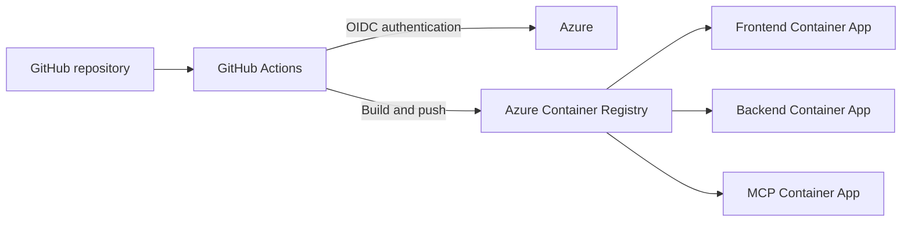

# Workshop Deployment: Azure Infrastructure and CI/CD

## Introduction

The workshop application uses two deployment paths. Terraform provisions the Azure infrastructure, identities, permissions, and service configuration. GitHub Actions builds and deploys the frontend, backend, and MCP application code.

In this section, you will review both paths, deploy the workshop environment, and verify that the application works end to end before beginning the hands-on labs.

## Learning objectives

By the end of this section, you will be able to:

- Describe the application's deployed Azure architecture.
- Explain which resources Terraform creates and manages.
- Explain how GitHub Actions authenticates to Azure with OpenID Connect (OIDC).
- Describe how application images move from source code to Azure Container Apps.
- Verify the health and connectivity of the deployed application.

## Deployment architecture

Terraform defines the Azure foundation used by the workshop application. The deployment includes:

- an Azure resource group;
- an Azure Container Registry;
- an Azure Container Apps environment;
- separate Container Apps for the frontend, backend, and MCP server;
- managed identities and role assignments;
- Application Insights and Log Analytics; and
- connections to the workshop's model deployments and PostgreSQL database.

GitHub Actions deploys application changes after the infrastructure is available:

## Prerequisites

Before beginning deployment, confirm that you have:

- access to the target Azure subscription;
- permission to provision resources and role assignments;
- Azure CLI and Terraform installed;
- access to the workshop GitHub repository;
- the required model deployments; and
- a PostgreSQL connection string for the workshop data.

_Exact version requirements and environment checks will be added during the deployment walkthrough._

## Part 1: Review the Terraform configuration

The Terraform configuration is located in `infra/reliableagents/terraform`.

Review how the configuration defines:

1. Resource naming, region, tags, and input variables.
2. Azure Container Registry and the Container Apps environment.
3. Frontend, backend, and MCP Container Apps.
4. Runtime and CI/CD managed identities.
5. Role assignments for image pulls, model access, and deployment operations.
6. Application Insights and Log Analytics.
7. Outputs used to locate and configure the deployed services.

## Part 2: Provision the Azure infrastructure

Use Terraform to initialize the working directory, validate the configuration, review the deployment plan, and provision the Azure resources.

_The exact Terraform commands, required variable values, and expected outputs will be added after the deployment configuration is finalized._

## Part 3: Configure GitHub Actions

The CI/CD identity uses a federated credential so GitHub Actions can authenticate to Azure through OIDC. No Azure client secret is stored in the repository.

Configure the repository with the Azure client, tenant, and subscription identifiers produced by the Terraform deployment. Then review the permissions granted to the deployment identity and the branch restriction applied by the federated credential.

## Part 4: Deploy the application

The repository contains three deployment workflows:

- `deploy-frontend.yml` deploys the web frontend.
- `deploy-backend.yml` deploys the FastAPI backend.
- `deploy-mcp.yml` deploys the MCP server.

Each workflow:

1. Runs when relevant files change on the `main` branch or when manually started.
2. Authenticates to Azure through OIDC.
3. Builds a container image in Azure Container Registry.
4. Tags the image with the Git commit SHA.
5. Updates the corresponding Azure Container App to use the new image.

## Part 5: Verify the deployment

After all three application components are deployed:

1. Confirm that each Container App has a healthy active revision.
2. Open the frontend URL.
3. Verify connectivity between the frontend, backend, MCP server, models, and database.
4. Submit a known-good request.
5. Confirm that the response includes an intent, execution steps, and a final answer.
6. Review the application telemetry for the request.

_Exact verification commands and expected results will be added during the deployment walkthrough._

## Success criteria

The workshop environment is ready when:

- Terraform has provisioned the required Azure infrastructure.
- GitHub Actions can authenticate to Azure through OIDC.
- The frontend, backend, and MCP images are deployed to their Container Apps.
- All application services report healthy status.
- A known-good request completes successfully from the frontend through the full application pipeline.
- You can explain the difference between infrastructure provisioning and application deployment.

## Next step

Continue to [Lab 1: Application and Architecture Tour](../02-hands-on-labs/01-application-overview/lab-1-guide.md).
