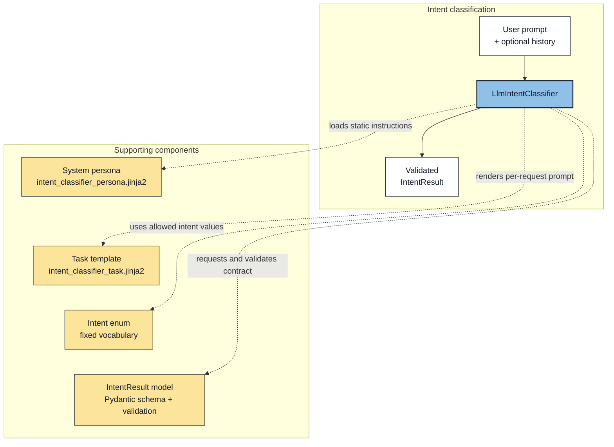
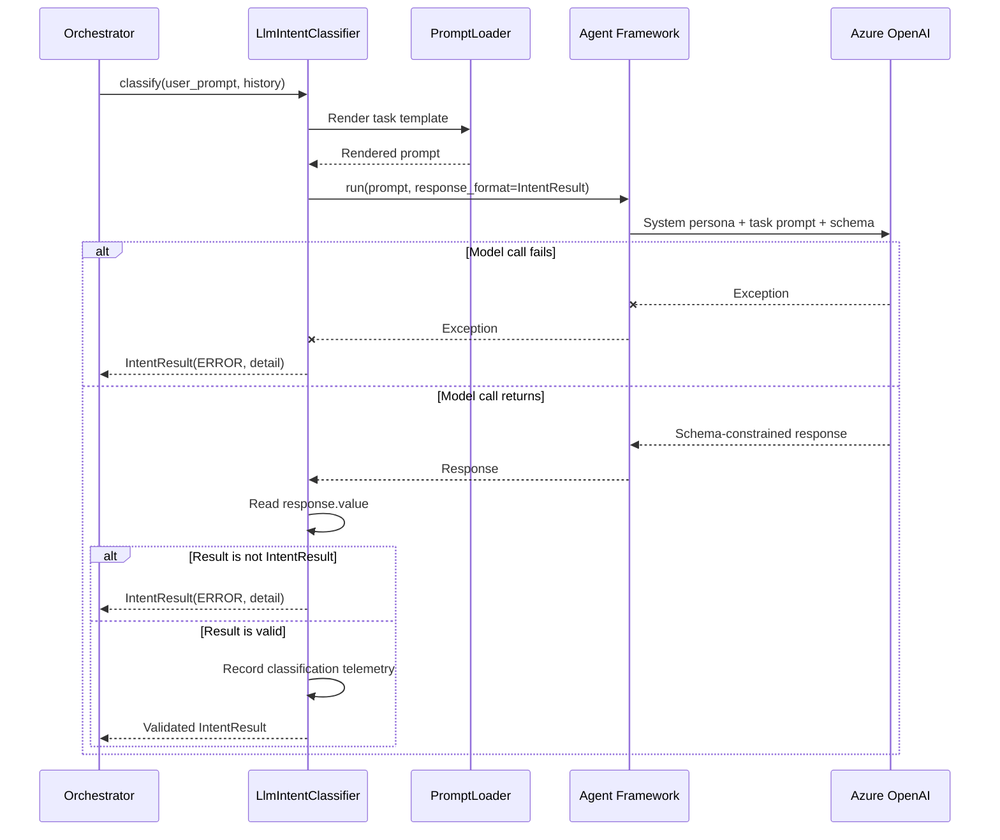

# Lab 2: Intent Classification

## Introduction

Users express the same operational need in many different ways. An agentic application must interpret that language without allowing every variation to create a new, uncontrolled execution path.

In this lab, you will implement the application's intent-classification workflow. The classifier accepts the user's unstructured request and returns a validated `IntentResult` containing a known intent, extracted entities, confidence, and supporting context. This is the transition point after which the control pipeline uses typed data rather than passing the user's raw text between components.

## Intent classification

### What is intent classification?

Intent classification is the process of identifying what a user wants the application to do. A user describes a need in ordinary language, and the classifier translates that request into a category the application understands. For example, differently worded requests about responding to an outage can all map to the same `EVENT_RESPONSE` intent.

In this application, classification includes more than assigning a label. The classifier:

- examines the current user prompt and any available conversation history;
- selects one value from the fixed `Intent` vocabulary;
- extracts relevant entities from the request;
- indicates whether the message continues the previous conversation turn;
- supplies a confidence score and supporting reasoning; and
- returns these values as a validated `IntentResult` object.

The result gives downstream code a stable description of the request without requiring that code to interpret the user's wording again. The classifier does not route the request or execute a domain agent. It only produces the structured classification that deterministic application code uses when deciding what may happen next.

Two classification outcomes require special attention. `UNKNOWN` means the classifier processed the request but could not map it to a supported user intent. `ERROR` means the classification operation failed, such as when the model call fails or does not return a valid `IntentResult`. Keeping these outcomes separate prevents a technical failure from being treated as an ordinary unsupported request.

### Why intent classification matters

Intent classification is foundational to reliable agentic systems. It places deterministic control around probabilistic model behavior, constraining what the model may decide and validating the result before the system acts.

> When an agentic application passes unstructured natural language directly from component to component, each component must interpret the request again. Raw text does not provide a stable contract that deterministic code can validate. Each time a model interprets unstructured text, it introduces another probabilistic decision point, increasing the likelihood of inconsistent downstream results. Intent classification creates that contract by converting the request into a known, typed result that the application can validate, route, authorize, and observe.

This creates a controlled boundary between probabilistic language understanding and deterministic application behavior.

The model interprets what the user means, but it does not invent the application's control flow. Instead, it must select from the fixed taxonomy defined by `Intent`. Downstream code can then use that validated value to apply explicit routing and authorization rules.

This design adds deterministic behavior in four ways:

- **Constrained vocabulary:** every request is mapped to a known intent rather than an arbitrary model-generated label.
- **Structured handoff:** schema-constrained output is parsed into `IntentResult` before downstream processing continues.
- **Validated state:** the Pydantic contract keeps the intent, extracted entities, and technical error detail in a predictable shape.
- **Explicit failure semantics:** `UNKNOWN` means the request was processed but could not be classified into a supported intent. `ERROR` means the classification operation itself failed. Treating these outcomes differently prevents a system outage from appearing to be an ordinary out-of-scope request.

The model is allowed to classify a request as `UNKNOWN`. Only deterministic application code sets `ERROR`, and it must include technical detail. The `IntentResult` validator enforces that invariant before the result enters the rest of the pipeline.

## Architecture context

Intent classification is the first model call in the request pipeline:

### Component relationships



### Classification sequence



> **Important:** The classifier does not select or execute a domain agent. Its responsibility ends when it returns the validated classification contract. The orchestrator uses that contract to determine which agents the request is permitted to reach.

### Intent classification components

| Component                          | Responsibility                                                                                                                                                    |
| ---------------------------------- | ----------------------------------------------------------------------------------------------------------------------------------------------------------------- |
| `LlmIntentClassifier`              | Renders the request prompt, calls the model with schema-constrained output, validates the result, and converts technical failures into `Intent.ERROR`.            |
| `Intent`                           | Defines the fixed intent vocabulary, including `UNKNOWN` and the system-only `ERROR` control state.                                                               |
| `IntentResult`                     | Defines the validated Pydantic contract passed from classification into deterministic routing. Its validator keeps `ERROR` and technical error detail consistent. |
| `intent_classifier_persona.jinja2` | Supplies the model's static system instructions: taxonomy, decision order, tie-breakers, examples, and the prohibition against returning `ERROR`.                 |
| `intent_classifier_task.jinja2`    | Builds the per-request input from the current user prompt and optional conversation history. It also defines continuation behavior.                               |

### Input and output contracts

| Direction | Value                                | Representation                                                  |
| --------- | ------------------------------------ | --------------------------------------------------------------- |
| Input     | `user_prompt` and optional `history` | Unstructured user text plus prior structured conversation turns |
| Output    | `IntentResult`                       | Validated Python object defined with Pydantic                   |

## Lab exercise

### Learning objectives

- Implement the intent-classification workflow from unstructured user input to a validated `IntentResult`.
- Request schema-constrained output from the model by using `IntentResult` as the response format.
- Validate the model response before returning it to the deterministic control pipeline.
- Preserve the distinction between an unclassifiable request and a technical failure.
- Verify successful and failed classifications with focused tests and the live Execution Trace.

### Build target

Complete the `classify()` method in `LlmIntentClassifier`. The method must:

1. Render the per-request classification prompt from the current user message and optional conversation history.
2. Call the model asynchronously and request schema-constrained output using `response_format=IntentResult`.
3. Convert a model-call exception into an `IntentResult` containing `Intent.ERROR` and technical detail.
4. Read the structured value returned by the model.
5. Verify that the value is an `IntentResult`.
6. Convert a malformed model response into an `IntentResult` containing `Intent.ERROR` and technical detail.
7. Record classification telemetry and return the validated result.

The following code is provided:

- `__init__()` and its Agent Framework client construction, identity, and prompt loading.
- The `classify()` signature and numbered comments describing each workflow step.
- `_extract_reasoning_summary()`, which is used only for logging.
- A temporary `Intent.ERROR` return so that the application reports an unfinished lab implementation without crashing.

The goal is to replace the temporary return by implementing the workflow described by the comments.

### Coding activities

1. Review the fixed intent taxonomy and `IntentResult` contract.
2. Examine the provided `classify()` skeleton and trace its numbered steps through the classification sequence.
3. Render the per-request prompt from `user_prompt` and `history`.
4. Call the Agent Framework asynchronously with `response_format=IntentResult`.
5. Handle model-call exceptions as technical `Intent.ERROR` results.
6. Extract and validate the structured value returned by the model.
7. Handle malformed responses as technical `Intent.ERROR` results.
8. Record the classification telemetry and return the validated `IntentResult`.
9. Run the application and submit a supported request to confirm that classification succeeds.

#### Step 1: Build the per-request task prompt

Before implementing the first block in `classify()`, examine the two prompt templates that work together on every classification request.

The system prompt in `src/app/prompts/system/intent_classifier_persona.jinja2` is the classifier's standing policy. It defines the fixed intent vocabulary, the order in which classification rules must be evaluated, tie-breakers for overlapping requests, representative examples, and the entities to extract. It also tells the model that `ERROR` is a system-only state: the model must return `UNKNOWN` when a request cannot be classified, while deterministic application code uses `ERROR` for technical failures.

The system prompt is loaded once when `LlmIntentClassifier` constructs its Agent Framework agent:

```python
instructions=PromptLoader.render(
	"system/intent_classifier_persona.jinja2"
)
```

This fixed taxonomy connects probabilistic language interpretation to deterministic routing. The model selects one known intent, but it does not choose or execute an agent. After classification, `RoutingMap` uses the validated intent to restrict which domain agents the request is permitted to reach:

| Classified intent       | Permitted domain agents             |
| ----------------------- | ----------------------------------- |
| `EVENT_RESPONSE`        | asset, event, outage, crew, weather |
| `SITUATIONAL_AWARENESS` | event, crew                         |
| `RELIABILITY`           | reliability, asset                  |
| `MAJOR_EVENT`           | event, asset, weather               |
| `CROSS_DOMAIN`          | reliability, event, crew, asset     |
| `DOMAIN_LOOKUP`         | asset, event, crew, reliability     |
| `UNKNOWN` and `ERROR`   | none                                |

The second template, `src/app/prompts/intent_classifier_task.jinja2`, supplies the information that changes on each call: the raw `user_prompt` and, when available, prior conversation `history`. History helps the classifier resolve follow-up language such as "that asset" or "a different one." The template also instructs the model not to let an unrelated prior turn change the meaning of a new topic.

Keeping these responsibilities separate is important. The system prompt remains the stable classification policy, while the task template places changing request data into known Jinja template variables. This reduces accidental prompt variation and ensures that each request is presented to the model with the same instruction structure. Templates improve consistency; the `IntentResult` response format and deterministic validation added in later steps enforce the output boundary.

Add the following code inside the `intent.classify` tracing span:

```python
# Step 1: Render the per-call task prompt (current message + prior turns).
prompt = PromptLoader.render(
	"intent_classifier_task.jinja2",
	user_prompt=user_prompt,
	history=history or [],
)
```

`history or []` gives the template an empty list when no conversation history was supplied. The template can therefore use one predictable loop and condition instead of handling `None`. The rendered task prompt is stored in `prompt`; the next step sends it to the agent alongside the system instructions already loaded during initialization.

### Test activities

You have now completed the intent-classification workflow in the `classify()` method. Before running the full application, let's test the classifier in isolation and confirm that it behaves correctly across both successful and unsuccessful model responses.

Lab 2 includes a predefined unit test class named `TestLab2LlmIntentClassifier`, located in `tests/test_lab2_llm_intent_classifier.py`. Its four tests follow the classifier through the outcomes it must handle:

1. A valid intent result passes through unchanged.
2. A valid `UNKNOWN` result remains `UNKNOWN`.
3. A model exception becomes an `ERROR` with diagnostic detail.
4. A malformed response becomes an `ERROR` with diagnostic detail.

These tests replace the real model call with controlled responses, so they run consistently without making an Azure OpenAI request.

To keep your focus on the classifier rather than a long pytest command, the repository includes the `test-lab2` script. You can use it to run all four tests together or select one test at a time.

Run all four tests from the repository root:

```bash
./test-lab2
```

The expected summary is `4 passed`.

#### Test 1: Valid intent result passes through unchanged

**What it does:** Verifies that the classifier returns a valid structured model result without modifying it.

**How it works:** The mocked model returns an `IntentResult` with `EVENT_RESPONSE`, confidence `0.95`, and the reasoning `The request reports an outage.` The classifier receives the user request `Report an outage at Central substation`.

**Command:**

```bash
./test-lab2 -k valid_intent_result
```

**Expected result:** The output shows `IntentResult` as the requested response format. The final classifier result contains `EVENT_RESPONSE` with confidence `0.95`, and the test reports `PASSED`.

#### Test 2: Valid unknown remains unknown

**What it does:** Verifies that a valid `UNKNOWN` classification remains distinct from a technical `ERROR`.

**How it works:** The mocked model returns an `IntentResult` with `UNKNOWN`, confidence `0.2`, and no technical error. The classifier receives the unsupported request `Write a poem about the ocean`.

**Command:**

```bash
./test-lab2 -k valid_unknown
```

**Expected result:** The final classifier result contains `UNKNOWN`, confidence `0.2`, and a null error value. The test reports `PASSED`.

#### Test 3: Model exception returns an error with detail

**What it does:** Verifies that a model-call failure becomes an `ERROR` result and preserves the exception message for diagnosis.

**How it works:** The mocked model call raises `RuntimeError("simulated model failure")` while the classifier processes `Show active outages`.

**Command:**

```bash
./test-lab2 -k model_exception
```

**Expected result:** The mocked outcome shows `RuntimeError: simulated model failure`. The final classifier result contains `ERROR` and the error value `simulated model failure`. The test reports `PASSED`.

#### Test 4: Malformed response returns an error with detail

**What it does:** Verifies that deterministic validation rejects a model response that is not an `IntentResult`.

**How it works:** The mocked model returns the dictionary `{"intent": "EVENT_RESPONSE"}` instead of a validated `IntentResult` while the classifier processes `Show active outages`.

**Command:**

```bash
./test-lab2 -k malformed_response
```

**Expected result:** The output shows the malformed dictionary as the mocked model outcome. The final classifier result contains `ERROR` and the error value `classifier returned no structured result`. The test reports `PASSED`.

After the focused tests pass, run the application and submit a supported request. Verify that the successful live classification appears in the Execution Trace with its intent, confidence, and extracted entities.

### Success criteria

You have completed Lab 2 when:

- You have completed the `classify()` method in `src/app/intent/llm_intent_classifier.py`, which codifies the intent-classification workflow.
- The method builds the classification prompt from the user request and conversation history, then calls the model asynchronously.
- The model is asked to return a schema-constrained `IntentResult`.
- Valid results pass through unchanged.
- Unsupported requests remain `UNKNOWN`, rather than becoming technical errors.
- Model exceptions and malformed responses become `ERROR` results with diagnostic detail.
- Running `./test-lab2` reports `4 passed`.
- A successful classification appears in the live Execution Trace with its intent, confidence, and extracted entities.
