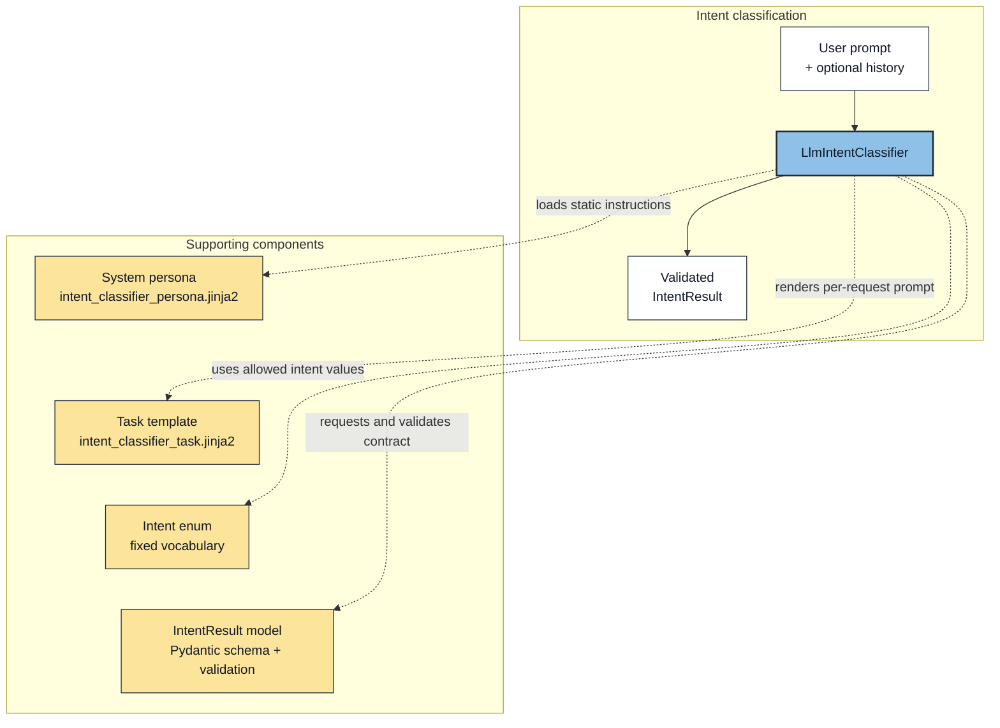
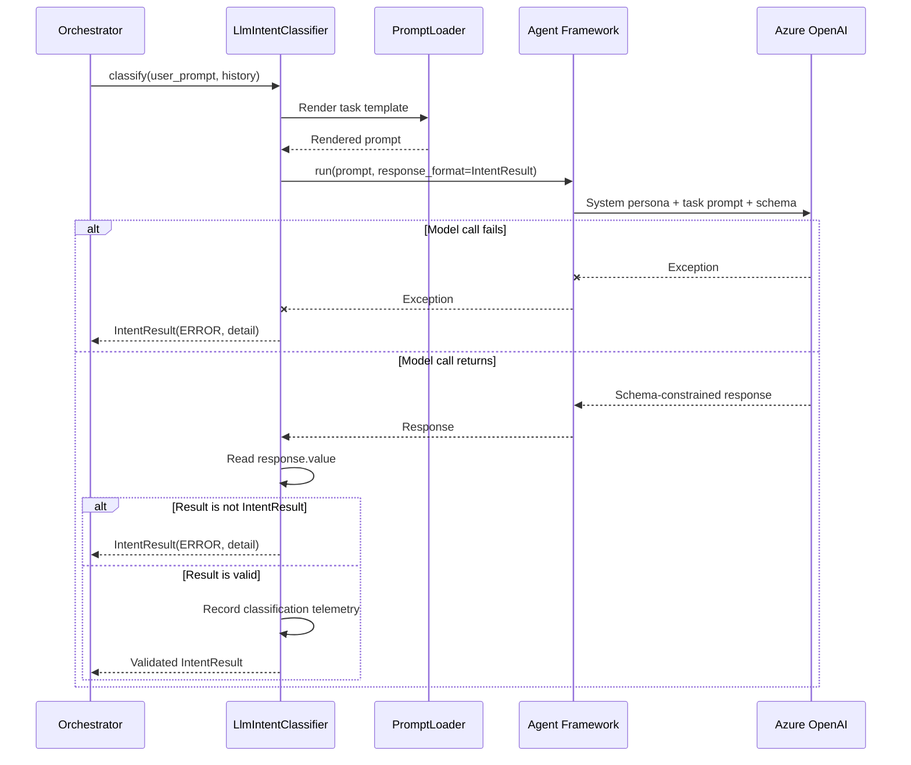

# Lab 2: Intent Classification

## Introduction

Users express the same operational need in many different ways. "Who is working the Riverside outage," "send me the crew for FDR-204," and "what is the status of that job" can all arrive at the same answer. An agentic application has to interpret that language without letting every phrasing create a different execution path.

In this lab you will implement the application's intent-classification workflow. `LlmIntentClassifier` accepts the user's unstructured request and returns a validated `IntentResult` carrying a known intent, extracted entities, confidence, and supporting context. It is the first model call in the pipeline, and it runs exactly once per request.

It is also the last unstructured moment on the control path. Free text enters here; a typed object leaves. The user's words still travel with the request as data, but they no longer decide anything - routing, authorization, and dispatch all read typed fields. The model interprets the sentence once, and that judgment becomes a value the rest of the system can check.

## Intent classification

### What is intent classification?

Intent classification is the process of identifying what a user wants the application to do. A user describes a need in ordinary language, and the classifier translates that request into a category the application understands. For example, differently worded requests about responding to an outage can all map to the same `EVENT_RESPONSE` intent.

In this application, classification includes more than assigning a label. The classifier:

- examines the current user prompt and any available conversation history;
- selects one value from the fixed `Intent` vocabulary;
- extracts relevant entities from the request;
- indicates whether the message continues the previous conversation turn;
- supplies a confidence score and supporting reasoning; and
- returns these values as a validated `IntentResult` object.

The result gives downstream code a stable description of the request without requiring that code to interpret the user's wording again. The classifier does not route the request or execute a domain agent. It only produces the structured classification that deterministic application code uses when deciding what may happen next.

Two classification outcomes require special attention. `UNKNOWN` means the classifier processed the request but could not map it to a supported user intent. `ERROR` means the classification operation failed, such as when the model call fails or does not return a valid `IntentResult`.

### Why intent classification matters

Without classification, every phrasing of a request is a new input to every component that handles it. Intent classification places deterministic control around probabilistic model behavior, constraining what the model may decide and validating the result before the system acts.

When an agentic application passes unstructured natural language directly from component to component, each component must interpret the request again. Raw text does not provide a stable contract that deterministic code can validate. Each time a model interprets unstructured text, it introduces another probabilistic decision point, increasing the likelihood of inconsistent downstream results. Intent classification creates that contract by converting the request into a known, typed result that the application can validate, route, authorize, and observe.

This creates a controlled boundary between probabilistic language understanding and deterministic application behavior.

The model interprets what the user means, but it does not invent the application's control flow. Instead, it must select from the fixed taxonomy defined by `Intent`. Downstream code can then use that validated value to apply explicit routing and authorization rules.

This design adds deterministic behavior in four ways:

- **Constrained vocabulary:** every request is mapped to a known intent rather than an arbitrary model-generated label.
- **Structured handoff:** schema-constrained output is parsed into `IntentResult` before downstream processing continues.
- **Validated state:** the Pydantic contract keeps the intent, extracted entities, and technical error detail in a predictable shape.
- **Explicit failure semantics:** `UNKNOWN` means the request was processed but could not be classified into a supported intent. `ERROR` means the classification operation itself failed. Treating these outcomes differently prevents a system outage from appearing to be an ordinary out-of-scope request.

The model is allowed to classify a request as `UNKNOWN`. Only deterministic application code sets `ERROR`, and it must include technical detail. The `IntentResult` validator enforces that invariant before the result enters the rest of the pipeline.

> **Deterministic engineering: one interpretation, carried forward.**
> Every component that re-reads the user's sentence adds another probabilistic decision point, and those points compound. Classify once and the system has a single interpretation it can validate, route on, and log. Interpret repeatedly and you have several interpretations that can disagree with each other - with no record of which one drove the outcome.

> **Deterministic engineering: record the signal even when you do not gate on it.**
> `IntentResult.confidence` is written to the trace span, the log line, and the final `ChatResult`, but no code branches on it. That is a deliberate position, not an oversight. A threshold you have not calibrated against real traffic rejects good classifications and admits bad ones with equal conviction. Recording the number first gives you the distribution you would need to set that threshold honestly. In Lab 3 you will meet the other half of this pattern, where `ReActReasoning` does gate on confidence - because a claim that the work is finished is something code can check.

## Architecture context

Intent classification is the first model call in the request pipeline, and the only one that runs before the application decides anything. The three views below move from structure to behavior to contract: which components participate, what happens on each call, and what crosses the boundary in each direction.

### Component relationships

`LlmIntentClassifier` is deliberately thin. It owns no classification logic of its own - it assembles constraints and enforces the result. The diagram separates the request path from the four components that supply those constraints.



Notice what the four supporting components have in common. Two constrain what goes in: the persona supplies the fixed policy, and the task template supplies the per-request data in a known shape. Two constrain what comes out: the `Intent` enum limits the vocabulary the model may choose from, and `IntentResult` defines the contract the reply must satisfy. The classifier's job is to hold those four constraints together around a single model call.

### Classification sequence

The following sequence traces one call to `classify()`, from the orchestrator's request through prompt rendering, the model call, validation, and the typed result returned on every path.



Two things are worth noticing.

**Every path returns an `IntentResult`.** The diagram has three exits - a failed model call, a response that is not an `IntentResult`, and a valid classification - and all three return the same type. The `Orchestrator` never has to ask whether classification succeeded; it reads a field on an object it is guaranteed to receive.

**The model appears exactly once.** Only the `AOAI` participant is probabilistic. Rendering the prompt, reading `response.value`, checking the type, and recording telemetry are all deterministic code running in your process.

> **Important:** The classifier does not select or execute a domain agent. Its responsibility ends when it returns the validated classification contract. The orchestrator uses that contract to determine which agents the request is permitted to reach.

> **Deterministic engineering: convert once, at the edge.**
> Ambiguity is unavoidable - users type sentences. The question is how far into the system that ambiguity travels. Here it is converted to a typed contract at the first opportunity, so every downstream component reads fields instead of re-interpreting prose. A system that keeps re-reading the original sentence has to be right about it repeatedly; this one has to be right once.

### Intent classification components

Five components participate in a classification, and only one of them calls a model. The other four are fixed assets - two templates, an enum, and a Pydantic model - that constrain the call and check its result.

| Component                          | Responsibility                                                                                                                                                    |
| ---------------------------------- | ----------------------------------------------------------------------------------------------------------------------------------------------------------------- |
| `LlmIntentClassifier`              | Renders the request prompt, calls the model with schema-constrained output, validates the result, and converts technical failures into `Intent.ERROR`.            |
| `Intent`                           | Defines the fixed intent vocabulary, including `UNKNOWN` and the system-only `ERROR` control state.                                                               |
| `IntentResult`                     | Defines the validated Pydantic contract passed from classification into deterministic routing. Its validator keeps `ERROR` and technical error detail consistent. |
| `intent_classifier_persona.jinja2` | Supplies the model's static system instructions: taxonomy, decision order, tie-breakers, examples, and the prohibition against returning `ERROR`.                 |
| `intent_classifier_task.jinja2`    | Builds the per-request input from the current user prompt and optional conversation history. It also defines continuation behavior.                               |

### Input and output contracts

The table below is the lab in one line. Read the `Representation` column: unstructured text goes in, a validated Python object comes out. Everything you implement in the coding section serves that single transition.

| Direction | Value                                | Representation                                                  |
| --------- | ------------------------------------ | --------------------------------------------------------------- |
| Input     | `user_prompt` and optional `history` | Unstructured user text plus prior structured conversation turns |
| Output    | `IntentResult`                       | Validated Python object defined with Pydantic                   |

## Lab exercise

### Learning objectives

By the end of this lab you will be able to:

- Convert an unstructured request into a validated `IntentResult`.
- Request schema-constrained output by passing `IntentResult` as the response format.
- Validate a model response before it reaches deterministic control code.
- Distinguish an unclassifiable request from a technical failure.
- Verify both outcomes with focused tests and the live Execution Trace.

### Build target

Complete the `classify()` method in `LlmIntentClassifier`. It renders the per-request prompt, calls the model with schema-constrained output, validates the structured reply, records telemetry, and returns a validated `IntentResult` - converting any technical failure along the way into `Intent.ERROR` with detail, never into `Intent.UNKNOWN`.

### What is already provided

- `__init__()`, including the Agent Framework client, identity, and prompt loading.
- The `classify()` signature and the numbered comments marking each step.
- `_extract_reasoning_summary()`, used only for logging.
- A temporary `Intent.ERROR` return so the application runs before the lab is finished.

Open `src/app/intent/llm_intent_classifier_lab.py`. Each step below begins with a comment that is already in the file. Find that comment and add the code beneath it, replacing the `NotImplementedError` when you reach Step 5.

Start the application with `./start --lab2` so it runs your file rather than the complete implementation. The complete version remains in `llm_intent_classifier.py` if you want to compare after finishing.

#### Step 1: Build the per-request task prompt

Before implementing the first block in `classify()`, examine the two prompt templates that work together on every classification request.

The system prompt in `src/app/prompts/system/intent_classifier_persona.jinja2` is the classifier's standing policy. It defines the fixed intent vocabulary, the order in which classification rules must be evaluated, tie-breakers for overlapping requests, representative examples, and the entities to extract. It also tells the model that `ERROR` is a system-only state: the model must return `UNKNOWN` when a request cannot be classified, while deterministic application code uses `ERROR` for technical failures.

Together, these instructions wrap probabilistic inference with two deterministic controls:

- **Fixed decision space:** the model must classify the request as one of the predefined intents. It cannot invent a new intent or route.
- **Fixed decision procedure:** the model is instructed to evaluate the rules in order, stop at the first match, and use explicit tie-breakers when a request could fit more than one intent.

The model can still interpret or apply these instructions incorrectly because the inference itself remains probabilistic. The deterministic boundary comes from combining the fixed prompt policy with the schema validation, intent-to-agent allow-list, and application-controlled routing introduced in this workflow.

The system prompt is loaded once when `LlmIntentClassifier` constructs its Agent Framework agent:

```python
instructions=PromptLoader.render(
	"system/intent_classifier_persona.jinja2"
)
```

This fixed taxonomy connects probabilistic language interpretation to deterministic routing. The model interprets the prompt and conversation history probabilistically, but it does so inside deterministic boundaries: a fixed intent vocabulary, ordered decision rules, and a validated output contract. It is instructed to return the first allowed intent whose rule matches the request, together with a confidence score. It cannot invent a route, choose an agent, or execute an action. After classification, `RoutingMap` uses the validated intent to restrict which domain agents the request is permitted to reach:

| Classified intent       | Permitted domain agents             |
| ----------------------- | ----------------------------------- |
| `EVENT_RESPONSE`        | asset, event, outage, crew, weather |
| `SITUATIONAL_AWARENESS` | event, crew                         |
| `RELIABILITY`           | reliability, asset                  |
| `MAJOR_EVENT`           | event, asset, weather               |
| `CROSS_DOMAIN`          | reliability, event, crew, asset     |
| `DOMAIN_LOOKUP`         | asset, event, crew, reliability     |
| `UNKNOWN` and `ERROR`   | none                                |

The second template, `src/app/prompts/intent_classifier_task.jinja2`, supplies the information that changes on each call: the raw `user_prompt` and, when available, prior conversation `history`. History helps the classifier resolve follow-up language such as "that asset" or "a different one." The template also instructs the model not to let an unrelated prior turn change the meaning of a new topic.

Keeping these responsibilities separate is important. The system prompt remains the stable classification policy, while the task template places changing request data into known Jinja template variables. This reduces accidental prompt variation and ensures that each request is presented to the model with the same instruction structure. Templates improve consistency; the `IntentResult` response format and deterministic validation added in later steps enforce the output boundary.

Add the following code inside the `intent.classify` tracing span:

```python
# Step 1: Render the per-call task prompt (current message + prior turns).
prompt = PromptLoader.render(
	"intent_classifier_task.jinja2",
	user_prompt=user_prompt,
	history=history or [],
)
```

`history or []` gives the template an empty list when no conversation history was supplied. The template can therefore use one predictable loop and condition instead of handling `None`. The rendered task prompt is stored in `prompt`; the next step sends it to the agent alongside the system instructions already loaded during initialization.

> **Deterministic engineering: separate stable policy from volatile input.**
> The persona is loaded once when the classifier is constructed; only the task template is rendered per request. Classification policy therefore cannot drift from one call to the next - only the data changes. Assembling one prompt by concatenating strings would let both vary, and you would have no way to tell which one moved.

#### Step 2: Call the model and request structured output

`LlmIntentClassifier` uses an internal Agent Framework `Agent` stored in `self._agent`. This is a local application object constructed once in the `__init__()` constructor. It combines the rendered system instructions, default model options, and an Agent Framework `OpenAIChatClient` configured for the intent model deployment. The agent object runs inside the application; the model inference occurs remotely in Azure OpenAI through its configured client.

Step 2 passes the task prompt from Step 1 to that agent. `await` pauses this classification operation without blocking the application's event loop while the remote model request completes.

The call also supplies `ChatOptions(response_format=IntentResult)`. This construct asks the Agent Framework and model service for a response constrained to the `IntentResult` schema instead of unrestricted prose. The requested structure includes:

- intent;
- extracted entities;
- confidence;
- reasoning;
- reasoning pattern;
- conversation-continuation state; and
- technical error detail.

Schema-constrained output is critical to agentic reliability because it turns a probabilistic model response into a predictable contract that deterministic code can validate and process. Once validated, downstream components can apply explicit routing, authorization, and error-handling rules without reinterpreting natural language.

> **Deterministic engineering: constrain the output at the call site, do not parse it afterward.**
> `response_format=IntentResult` makes the schema part of the request, so the constraint is enforced during decoding. The alternative - asking for JSON in prose and parsing the reply - moves the failure out of the model's decoder and into your string handling, where it surfaces later and reads as a bug in your code.

Add the model call and its failure handling after Step 1:

```python
# Step 2: Call the model, requesting structured output (response_format=IntentResult).
try:
	response = await self._agent.run(
		prompt,
		options=ChatOptions(response_format=IntentResult),
	)
except Exception as ex:
	# Step 2a (RELIABILITY): the call itself failed -> Intent.ERROR + detail,
	# never UNKNOWN (see class docstring).
	logging.exception("LlmIntentClassifier.classify: model call failed")
	span.set_attribute("intent", Intent.ERROR.value)
	span.set_attribute("success", False)
	span.record_exception(ex)
	return IntentResult(intent=Intent.ERROR, error=str(ex) or type(ex).__name__)
```

The `try` block catches failures from the remote model service before they can escape into the rest of the application. If that call raises an exception, Step 2a converts the exception into the same typed contract used by the successful path. It returns `Intent.ERROR`, not `Intent.UNKNOWN`, because the system failed to complete classification; it did not successfully determine that the user's request was unsupported.

The failure path also preserves evidence in two places. `logging.exception(...)` records the message and stack trace in the application log. The active trace span records the failed intent, `success=False`, and the exception for distributed tracing. The returned `IntentResult` carries `str(ex)` as technical detail. If the exception message is empty, `type(ex).__name__` uses the exception's class name instead. This guarantees that `error` contains diagnostic information. The application can then report the failure through logs, traces, and the returned `IntentResult` without allowing the exception to stop the request pipeline.

> **Deterministic engineering: a failed call is not an answer.**
> `ERROR` means the system could not classify. `UNKNOWN` means it classified successfully and found no supported intent. Collapsing those into one value would let an outage look like an unsupported question - and the request would be declined politely instead of retried or alerted on.

#### Step 3: Validate the structured result

Add a deterministic gate:

```python
# Step 3: Pull the structured result off the response.
result = response.value

if not isinstance(result, IntentResult):
	# Step 3a (RELIABILITY): call succeeded but returned no valid structure -
	# still a system fault, not a user-side UNKNOWN.
	logging.warning("LlmIntentClassifier.classify: no structured IntentResult returned")
	span.set_attribute("intent", Intent.ERROR.value)
	span.set_attribute("success", False)
	return IntentResult(
		intent=Intent.ERROR,
		error="classifier returned no structured result",
	)
```

Step 3 reads the parsed value from the `response` object returned from the model call. The `isinstance` check is a deterministic gate: only a valid `IntentResult` passes downstream; everything else exits as `Intent.ERROR`.

If the call completed but did not return an `IntentResult`, Step 3a logs the failure and returns a typed `Intent.ERROR`.

> **Note:** `Intent.ERROR` is returned because the classifier failed to produce a valid result. `Intent.UNKNOWN` is reserved for a successful classification that finds no supported intent.

> **Deterministic engineering: trust the boundary, verify anyway.**
> `response_format` is a strong guarantee, not a proof. The `isinstance` check costs one comparison and converts a whole class of "impossible" failures into a typed `ERROR` at the boundary that produced it. Guarantees you did not implement yourself are worth re-checking at the seam.

#### Step 4: Record classification telemetry

Add an observability block:

```python
# Step 4: Log the classification (span attributes + reasoning summary).
summary = self._extract_reasoning_summary(response)

# UNKNOWN counts as success here - it's a valid result, not a failure.
entities_set = {k: v for k, v in result.entities.model_dump().items() if v is not None}
span.set_attribute("intent", result.intent.value)
span.set_attribute("confidence", result.confidence)
span.set_attribute("success", result.intent != Intent.ERROR)
span.set_attribute("entities", str(entities_set))

if summary:
	span.set_attribute("reasoning_summary", summary)
logging.info(
	"LlmIntentClassifier.classify: intent=%s confidence=%.2f continues_previous=%s entities=%s",
	result.intent.value,
	result.confidence,
	result.continues_previous,
	entities_set,
)
```

Step 4 is a pure observability step. It does not change the validated `IntentResult` or affect routing. It removes empty entity values, then records the intent, confidence, success state, and remaining entities on the active trace span. `Intent.UNKNOWN` counts as a successful classification because it is a valid result; only `Intent.ERROR` records failure.

When available, the classifier adds the model's reasoning summary to the trace. It also writes a concise classification summary to the application log for testing and diagnosis.

> **Deterministic engineering: observability is not error handling.**
> Step 4 changes no control flow and alters no result. It records what happened and returns. Mixing the two is how a `catch` block that was only supposed to log ends up swallowing a failure - which is precisely the bug Step 2a exists to prevent.

#### Step 5: Return the validated result

```python
# Step 5: Return the validated result.
return result
```

The classifier returns the validated `IntentResult`. This typed object is ready for deterministic routing.

### Coding wrap-up

You have completed the intent-classification workflow in `classify()`. One unstructured string entered, one validated object left, and the model was consulted exactly once. Every decision the application makes from here reads typed fields - it never revisits the user's original wording to decide what to do.

> **Note:**
>
> 1. Save your changes.
> 2. Start the application by typing `./start` in the VS Code terminal.
> 3. Move to the **Test activities** section.

### Test activities

Let's test the classifier in isolation and confirm that it behaves correctly across both successful and unsuccessful model responses.

Lab 2 includes a predefined unit test class named `TestLab2LlmIntentClassifier`, located in `tests/test_lab2_llm_intent_classifier.py`. Its four tests follow the classifier through the outcomes it must handle:

1. A valid intent result passes through unchanged.
2. A valid `UNKNOWN` result remains `UNKNOWN`.
3. A model exception becomes an `ERROR` with diagnostic detail.
4. A malformed response becomes an `ERROR` with diagnostic detail.

The first two tests cover successful classification, including the case where the correct answer is "no supported intent." The last two cover technical failure. Read together, they prove the distinction this lab is built on: a request the classifier could not map is not the same outcome as a classifier that could not run.

These tests replace the real model call with controlled responses, so they run consistently without making an Azure OpenAI request.

To keep your focus on the classifier rather than a long pytest command, the repository includes the `test-lab2` script. You can use it to run all four tests together or select one test at a time.

Run all four tests from the repository root:

```bash
./test-lab2
```

The expected summary is `4 passed`.

#### Test 1: Valid intent result passes through unchanged

**What it does:** Verifies that the classifier returns a valid structured model result without modifying it.

**How it works:** The mocked model returns an `IntentResult` with `EVENT_RESPONSE`, confidence `0.95`, and the reasoning `The request reports an outage.` The classifier receives the user request `Report an outage at Central substation`.

**Command:**

```bash
./test-lab2 -k valid_intent_result
```

**Expected result:** The output shows `IntentResult` as the requested response format. The final classifier result contains `EVENT_RESPONSE` with confidence `0.95`, and the test reports `PASSED`.

#### Test 2: Valid unknown remains unknown

**What it does:** Verifies that a valid `UNKNOWN` classification remains distinct from a technical `ERROR`.

**How it works:** The mocked model returns an `IntentResult` with `UNKNOWN`, confidence `0.2`, and no technical error. The classifier receives the unsupported request `Write a poem about the ocean`.

**Command:**

```bash
./test-lab2 -k valid_unknown
```

**Expected result:** The final classifier result contains `UNKNOWN`, confidence `0.2`, and a null error value. The test reports `PASSED`.

#### Test 3: Model exception returns an error with detail

**What it does:** Verifies that a model-call failure becomes an `ERROR` result and preserves the exception message for diagnosis.

**How it works:** The mocked model call raises `RuntimeError("simulated model failure")` while the classifier processes `Show active outages`.

**Command:**

```bash
./test-lab2 -k model_exception
```

**Expected result:** The mocked outcome shows `RuntimeError: simulated model failure`. The final classifier result contains `ERROR` and the error value `simulated model failure`. The test reports `PASSED`.

#### Test 4: Malformed response returns an error with detail

**What it does:** Verifies that deterministic validation rejects a model response that is not an `IntentResult`.

**How it works:** The mocked model returns the dictionary `{"intent": "EVENT_RESPONSE"}` instead of a validated `IntentResult` while the classifier processes `Show active outages`.

**Command:**

```bash
./test-lab2 -k malformed_response
```

**Expected result:** The output shows the malformed dictionary as the mocked model outcome. The final classifier result contains `ERROR` and the error value `classifier returned no structured result`. The test reports `PASSED`.

After the focused tests pass, submit a supported request. Verify that the successful live classification appears in the Execution Trace with its intent, confidence, and extracted entities.

> **Deterministic engineering: test the failure axis as hard as the success axis.**
> Two of these four tests assert on failures, and both check the `error` detail rather than just the intent value. A system that only proves its happy path will still return `ERROR` when something breaks - it just will not be able to tell you why. The diagnostic detail is part of the contract, so it is part of the test.
