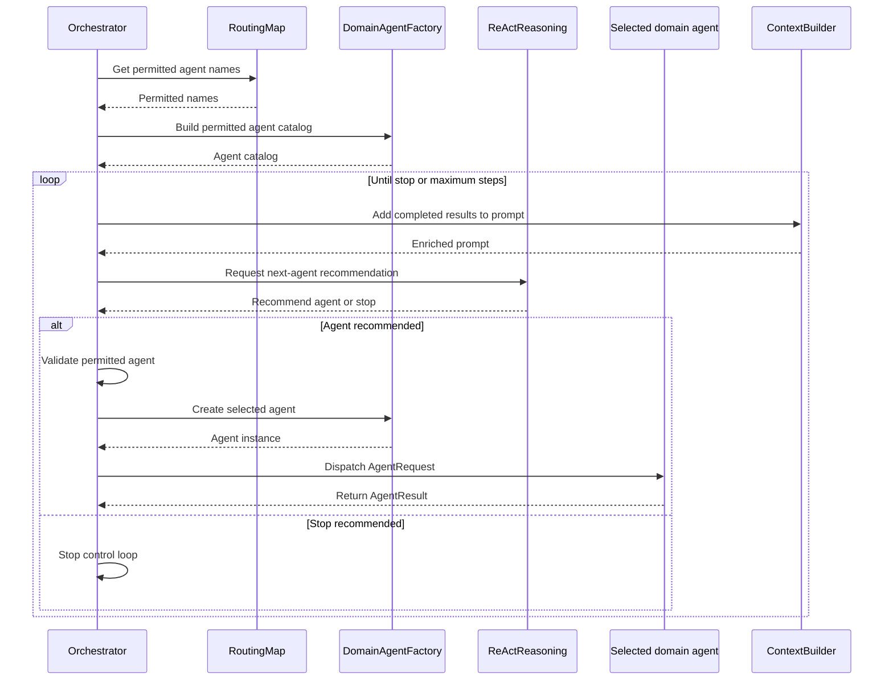

# Lab 3: Reliable Orchestration

## Introduction

An agentic application may need several specialized agents to answer one request. Based on its reasoning, a model can suggest which agent should run next. Because model output is probabilistic, deterministic application code acts as a control gate: it validates the model's proposal against application rules and invokes the agent only when that choice is permitted and available.

In this lab, you will implement the application's deterministic orchestration workflow. `ReActReasoning` uses the model to propose the next domain agent or indicate that processing should stop. The `Orchestrator` validates that proposal against the intent's allow-list, resolves and runs the permitted agent, and collects its typed `AgentResult`. This creates a reliable boundary: the model proposes what might happen next, while deterministic code decides what is allowed to happen.

## Reliable orchestration

### What is reliable orchestration?

Reliable orchestration combines a language model's ability to reason about the next step with application code that validates and executes it. The `ReActReasoning` class asks a language model to recommend which domain agent should run next or whether no more agents are needed. It returns the proposed agent, confidence score, and explanation in a validated `ReActDecision` object.

> **Keep in mind:** A language model can understand and generate text, but it cannot execute code or take actions on its own.

The `process_request_stream()` method in the `Orchestrator` class owns the deterministic control loop. The `Orchestrator` passes a list of permitted agent names to the `ReActReasoning` class. The class returns a `ReActDecision` that recommends one of those agents or indicates that processing should stop.

The loop ends when no additional agent is needed, an agent provides no new information, or the maximum number of steps is reached.

### Why reliable orchestration matters

A model's recommendation is probabilistic and should not be treated as permission to execute code. The `Orchestrator` acts as the deterministic control gate: it restricts which agents may be selected, validates the model's proposal, and controls when execution stops.

> The model recommends the next step. The `Orchestrator` decides whether that step is allowed and executes it.

## Architecture context

Reliable orchestration is the controlled sequence between intent classification and response composition. The `Orchestrator` controls each step while `ReActReasoning` recommends which permitted domain agent should run next:

### Component relationships

The highlighted components show where probabilistic reasoning meets deterministic control. `ReActReasoning` proposes the next agent, while the `Orchestrator` owns the reason-dispatch-observe loop and executes only validated choices.


### Orchestration sequence

The following sequence traces one pass through the control loop, from preparing the permitted agent catalog to reasoning, validation, dispatch, and observation.



### Reliable orchestration components

| Component            | Responsibility                                                                                    |
| -------------------- | ------------------------------------------------------------------------------------------------- |
| `Orchestrator`       | Owns the deterministic control loop, validates decisions, dispatches agents, and stops execution. |
| `ReActReasoning`     | Recommends the next permitted agent or indicates that processing should stop.                     |
| `RoutingMap`         | Returns the agent names permitted for the classified intent.                                      |
| `DomainAgentFactory` | Builds the permitted agent catalog and creates the selected agent.                                |
| `ContextBuilder`     | Adds completed `AgentResult` data to the next reasoning prompt.                                   |

## Lab exercise

### Learning objectives

- Implement the recommendation and dispatch portion of the ReAct control loop.
- Keep model recommendations separate from application-controlled execution.
- Stop processing when the model recommends no additional agent.
- Reject an agent that is outside the classified intent's allow-list.
- Dispatch a permitted agent with a typed `AgentRequest` and collect its typed `AgentResult`.
- Verify permitted, stopped, and rejected decisions with focused tests and the live Execution Trace.

### Build target

Complete the student coding block inside `Orchestrator.process_request_stream()`. The block must:

1. Ask `ReActReasoning` to recommend the next agent or to stop.
2. Stream each reasoning decision to the Execution Trace.
3. Use the final decision to select the next action.
4. Stop the loop when no next agent is recommended.
5. Reject a recommended agent that is outside the intent's allow-list.
6. Resolve the selected agent and fail when it is unavailable.
7. Stream the dispatch step.
8. Call the selected agent with a typed `AgentRequest`.
9. Add the returned `AgentResult` to the collected results.

The following code is provided:

- Intent classification and the `UNKNOWN` and `ERROR` short-circuit.
- The authorized agent allow-list and catalog.
- The `MAX_STEPS` loop and enriched prompt construction.
- Agent-result trace streaming and duplicate-result stopping.
- Error streaming, response assembly, telemetry, and conversation storage.

The goal is to complete the recommendation, validation, and dispatch sequence between the enriched prompt and the provided result-processing code.

### Coding activities

1. Examine the provided ReAct loop and identify which operations belong to the model and which belong to the `Orchestrator`.
2. Request the next-agent recommendation and stream its reasoning decisions.
3. Select the final decision and stop when it contains no next agent.
4. Validate the recommended agent against the intent's allow-list.
5. Resolve the permitted agent and emit its dispatch event.
6. Invoke the agent with a typed `AgentRequest` and collect its `AgentResult`.
7. Run the focused orchestration tests.
8. Submit a supported request and inspect the Execution Trace.

#### Step 1: Request and stream the model recommendation

The provided loop builds `enriched_prompt` from the original request and any agent results collected during earlier iterations. Pass that prompt and the authorized agent catalog to `ReActReasoning`:

```python
# Ask the model to recommend the next agent or to stop.
decisions = await self._reasoning.reason(enriched_prompt, catalog)

# Send every reasoning decision to the Execution Trace display in the UI.
for step_decision in decisions:
	yield self._stream_events.build(
		"step", self._reasoning.to_trace_step(step_decision, is_first_decision)
	)
```

`ReActReasoning` proposes what should happen next but does not invoke an agent. The `Orchestrator` also streams each reasoning decision so the recommendation is visible before any action is taken.

#### Step 2: Select the final decision or stop

Use the last reasoning decision as the proposed next action:

```python
# Use the final decision to stop or select the next agent.
decision = decisions[-1]

# Stop when the model recommends no next agent.
if decision.next_agent is None:
	break
```

A null `next_agent` means the model recommends that no additional domain agent is needed. The `Orchestrator`, not the model, performs the `break` that stops execution.

#### Step 3: Enforce the intent allow-list

Validate the recommendation before resolving or invoking an agent:

```python
# Reject agents outside the intent's allow-list.
if decision.next_agent not in allowed:
	raise RuntimeError(
		f"Agent is not allowed for this intent: {decision.next_agent}"
	)
```

The allow-list is the deterministic authorization boundary. A model recommendation cannot expand the set of agents permitted for the classified intent. Raising the error before calling the factory ensures that an unauthorized agent is never created or executed.

#### Step 4: Resolve and announce the permitted agent

Resolve the selected agent and verify that it is registered:

```python
# Get the selected agent; fail if it is not registered.
agent = self._factory.get(decision.next_agent)
if agent is None:
	raise RuntimeError(f"Agent is not available: {decision.next_agent}")

# Announce the agent dispatch in the Execution Trace display in the UI.
yield self._stream_events.build("step", TraceStep(
	agent=decision.next_agent,
	action="dispatch",
	summary=f"Calling {decision.next_agent} agent to fetch data",
))
```

Passing the allow-list does not guarantee that the selected agent is available. The factory lookup verifies registration, and the dispatch event makes the approved action visible before the agent runs.

#### Step 5: Invoke the agent and collect its result

Call the selected agent with the current entities and enriched prompt:

```python
# Call the selected agent with the entities and enriched prompt.
result = await agent.handle(AgentRequest(
	agent=decision.next_agent,
	entities=intent_result.entities,
	user_prompt=enriched_prompt,
))

# Save the result for the next reasoning step and final response.
results.append(result)
```

`AgentRequest` is the typed input contract for the domain agent. The returned `AgentResult` is added to `results`, where it becomes evidence for the next reasoning iteration and input to the final response.

### Coding wrap-up

At this point, you have completed the recommendation, validation, and dispatch portion of the ReAct control loop.

The surrounding provided code bounds the loop with `MAX_STEPS`, streams the agent result, stops when an agent returns duplicate meaningful data, handles failures, and assembles the final response.

> **Note:**
>
> 1. Save your changes.
> 2. Move to the **Test activities** section.

### Test activities

Let's test the orchestration control loop in isolation and confirm that it executes only permitted model recommendations.

Lab 3 includes a predefined unit test class named `TestLab3ReliableOrchestration`, located in `tests/test_lab3_reliable_orchestration.py`. Its three tests follow the outcomes the deterministic control gate must handle:

1. A permitted agent executes, and the next decision stops the loop.
2. A stop decision completes without dispatching an agent.
3. An agent outside the intent's allow-list is rejected.

These tests replace model reasoning and domain agents with controlled responses, so they run consistently without making an Azure OpenAI request or calling a real domain agent.

To keep your focus on orchestration rather than a long pytest command, the repository includes the `test-lab3` script. You can use it to run all three tests together or select one test at a time.

Run all three tests from the repository root:

```bash
./test-lab3
```

The expected summary is `3 passed`.

#### Test 1: Permitted agent executes and the loop stops

**What it does:** Verifies that the `Orchestrator` executes a permitted agent and stops when the next reasoning decision indicates that the request is complete.

**How it works:** The first mocked `ReActDecision` recommends the permitted `asset` agent. That agent returns a typed `AgentResult`. The second decision recommends stopping. The test verifies that the factory resolves `asset`, the agent receives the expected `AgentRequest`, and the stream ends with a final event.

**Command:**

```bash
./test-lab3 -k selects_and_executes
```

**Expected result:** The `asset` agent is created and called once with the original user prompt. The orchestration stream produces a final event, and the test reports `PASSED`.

#### Test 2: Stop decision causes no dispatch

**What it does:** Verifies that the `Orchestrator` does not execute an agent when `ReActReasoning` indicates that no additional work is needed.

**How it works:** The mocked reasoning result returns a `ReActDecision` whose `next_agent` value is null. The test verifies that the factory is never asked to create an agent and that the stream still ends with a final event.

**Command:**

```bash
./test-lab3 -k stops_without_dispatching
```

**Expected result:** No domain agent is created or called. The orchestration stream produces a final event, and the test reports `PASSED`.

#### Test 3: Unauthorized agent is rejected

**What it does:** Verifies that the `Orchestrator` rejects a model recommendation that falls outside the classified intent's allow-list.

**How it works:** The request is classified as `EVENT_RESPONSE`, but the mocked reasoning result recommends the unauthorized `customer` agent. The test verifies that the factory is never asked to create that agent and that the stream reports an error containing `not allowed`.

**Command:**

```bash
./test-lab3 -k rejects_agent_outside
```

**Expected result:** The `customer` agent is not created or called. The orchestration stream produces an error explaining that the agent is not allowed, and the test reports `PASSED`.

After the focused tests pass, submit a supported request. Verify in the Execution Trace that reasoning recommends an agent, the `Orchestrator` dispatches only a permitted agent, and processing ends with a final response.

### Success criteria

You have completed Lab 3 when:

- You have completed the recommendation, validation, and dispatch block in `Orchestrator.process_request_stream()`.
- The provided loop builds the available agent catalog from the classified intent's allow-list.
- `ReActReasoning` recommends the next agent or indicates that processing should stop.
- A stop decision ends the loop without dispatching another agent.
- An agent outside the allow-list is rejected before it can be created or called.
- A permitted agent receives a typed `AgentRequest`, and its `AgentResult` is added to the orchestration results.
- The provided stopping controls still bound the loop with `MAX_STEPS` and stop duplicate meaningful results.
- Running `./test-lab3` reports `3 passed`.
- A supported request shows reasoning, permitted dispatch, and the final response in the Execution Trace.
