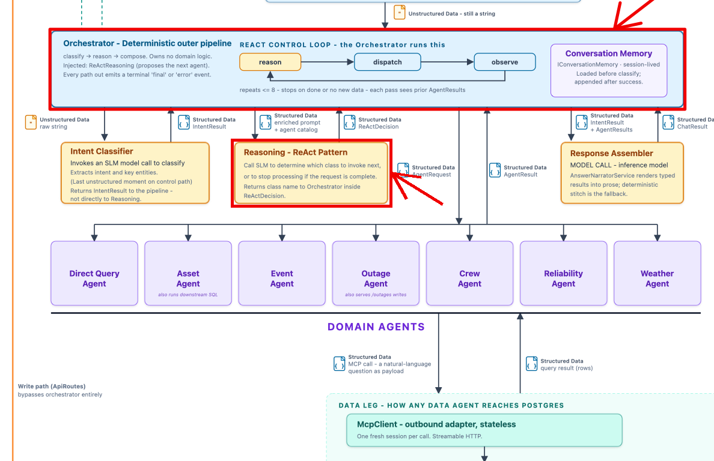
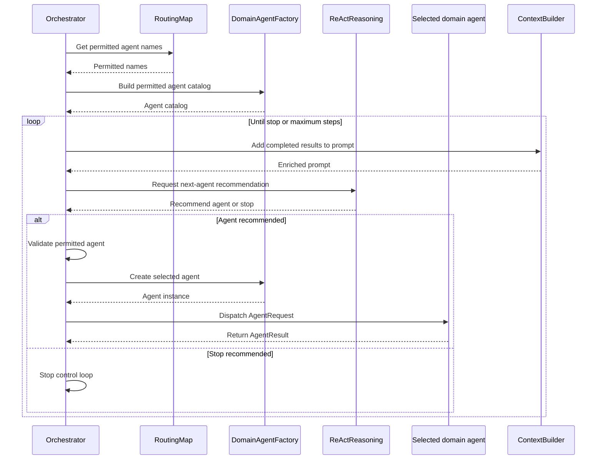

# Lab 3: Reliable Orchestration

## Introduction

Answering one operational question can take several specialized agents. A model is good at judging which one should run next, but its output is probabilistic. The same request can produce a different recommendation each time, and nothing in the model stops it from naming an agent the request was never authorized to use.

In this lab you will build the control loop that makes those recommendations safe to act on. `ReActReasoning` proposes the next domain agent or signals that processing should stop. The `Orchestrator` validates that proposal against the intent's allow-list, resolves and runs the permitted agent, and collects its typed `AgentResult`. The model proposes what might happen next. Deterministic code decides what is allowed to happen.

## Reliable orchestration

### What is reliable orchestration?

Reliable orchestration combines a language model's ability to reason about the next step with application code that validates and executes it. Two classes divide that work.

The `ReActReasoning` class asks a language model to recommend which domain agent should run next, or whether no more agents are needed. It returns that recommendation as a validated `ReActDecision` carrying the proposed agent, a confidence score, and an explanation.

> **Keep in mind:** A language model can understand and generate text, but it cannot execute code or take actions on its own.

The `process_request_stream()` method in the `Orchestrator` class owns the control loop. It hands `ReActReasoning` the list of agents the classified intent permits, and gets back a decision naming one of them or indicating that processing should stop.

The loop ends when no additional agent is needed, an agent provides no new information, or `MAX_STEPS` is reached.

### Why reliable orchestration matters

Without a gate, every model recommendation becomes an execution. The same request can take a different path on each run, an agent can be invoked that the request was never authorized to use, and a failure surfaces far from its cause.

Deterministic control is what turns a probabilistic recommendation into a dependable system:

| Property    | What provides it                                                                               |
| ----------- | ---------------------------------------------------------------------------------------------- |
| Reliability | The allow-list rejects any agent the intent does not permit.                                   |
| Accuracy    | Decisions arrive as validated typed objects, so code acts on checked fields rather than prose. |
| Coherence   | One agent runs at a time, and each result becomes evidence for the next decision.              |
| Consistency | An intent always permits the same agents, however the user phrased the request.                |

> The model recommends the next step. The `Orchestrator` decides whether that step is allowed and executes it.

## Architecture context

Reliable orchestration sits between intent classification and response composition.

### Component relationships

The highlighted components show where probabilistic reasoning meets deterministic control. `ReActReasoning` proposes the next agent, while the `Orchestrator` owns the reason-dispatch-observe loop and executes only validated choices.



### Orchestration sequence

The following sequence traces one pass through the control loop, from preparing the permitted agent catalog to reasoning, validation, dispatch, and observation. Notice that `Validate permitted agent` is a call the `Orchestrator` makes to itself. No other component is consulted, because that decision is pure deterministic code.



### Reliable orchestration components

| Component            | Type          | Responsibility                                                                      |
| -------------------- | ------------- | ----------------------------------------------------------------------------------- |
| `Orchestrator`       | Deterministic | Owns the control loop, validates decisions, dispatches agents, and stops execution. |
| `ReActReasoning`     | Model call    | Recommends the next permitted agent or indicates that processing should stop.       |
| `RoutingMap`         | Deterministic | Returns the agent names permitted for the classified intent.                        |
| `DomainAgentFactory` | Deterministic | Builds the permitted agent catalog and creates the selected agent.                  |
| `ContextBuilder`     | Deterministic | Adds completed `AgentResult` data to the next reasoning prompt.                     |

## Lab exercise

### Learning objectives

By the end of this exercise you will be able to keep model recommendations separate from application-controlled execution, enforce an intent allow-list before dispatch, and pass typed objects between the `Orchestrator` and its agents.

### What is already provided

- Intent classification, with the `UNKNOWN` and `ERROR` short-circuit.
- The authorized agent allow-list and catalog.
- The `MAX_STEPS` loop and the enriched prompt.
- Agent-result streaming and duplicate-result stopping.
- Error handling, response assembly, telemetry, and conversation storage.

Open the `Orchestrator` class in `src/app/agents/orchestrator_lab.py`. You will complete the five steps below inside `Orchestrator.process_request_stream()`, between the enriched prompt and the provided result-processing code.

Start the application with `./start --lab3` so it runs your file rather than the complete implementation. The complete version remains in `orchestrator.py` if you want to compare after finishing.

#### Step 1: Request and stream the model recommendation

At this point, you will invoke the `ReActReasoning` agent, passing it the enriched prompt and the catalog of authorized agents for the specific intent. The agent will return its decision.

```python
# Ask the model to recommend the next agent or to stop.
# Each decision carries: next_agent, confidence, reasoning.
decisions = await self._reasoning.reason(enriched_prompt, catalog)

# Send every reasoning decision to the Execution Trace display in the UI.
for step_decision in decisions:
    yield self._stream_events.build(
        "step", self._reasoning.to_trace_step(step_decision, is_first_decision)
    )
```

`ReActReasoning` only proposes the next agent - it cannot run it. That is the job of the `Orchestrator`.

Notice what comes back. Each decision is a typed object carrying `next_agent`, `confidence`, and `reasoning`. That is structured output, not free text. Deterministic code can validate and act on typed fields. It cannot do that reliably with a sentence.

> **Deterministic engineering: record the proposal before you judge it.**
> The decision is streamed to the Execution Trace _before_ the allow-list check runs. Rejected recommendations are therefore visible too. An audit trail that only records what executed cannot tell you what the model tried to do - which is exactly what you need when diagnosing a bad run.

#### Step 2: Select the final decision or stop

The agent can return more than one decision, so you will act on the last one. If it names no next agent, the loop stops.

```python
# Use the final decision to stop or select the next agent.
decision = decisions[-1]

# Stop when the model recommends no next agent.
if decision.next_agent is None:
    break
```

A null `next_agent` means no additional domain agent is needed. Note that the model cannot stop the loop. Deterministic code decides which decision counts, and deterministic code performs the `break`.

> **Deterministic engineering: termination cannot depend on the model cooperating.**
> Three independent conditions end this loop: the model proposes no next agent, `MAX_STEPS` is reached, or an agent returns a result already seen. The model influences one. A model that never says "stop" still terminates, because the other two are enforced by code the model cannot reach.

#### Step 3: Enforce the intent allow-list

Before anything runs, you will check the recommended agent against the allow-list for the classified intent.

```python
# Reject agents outside the intent's allow-list.
if decision.next_agent not in allowed:
    raise RuntimeError(
        f"Agent is not allowed for this intent: {decision.next_agent}"
    )
```

This is a deterministic gate. The model proposes an agent, but deterministic code decides whether it may run, and no recommendation can expand the agents permitted for this intent. Because the check happens before the agent is created, an unauthorized agent never executes and the request ends here.

> **Deterministic engineering: authorization lives outside the prompt.**
> `allowed` is a dictionary lookup, not an instruction the model is asked to respect. Restrictions written into a prompt are advisory - persuasive phrasing can talk a model past them. A membership test has no such surface. However the request is worded, `EVENT_RESPONSE` permits exactly five agents.

#### Step 4: Resolve and announce the permitted agent

Next you will resolve the approved name into a real agent instance and announce the dispatch. `self._factory` is the `DomainAgentFactory`, which knows every domain agent the application supports and builds a fresh one, already wired with its dependencies.

```python
# Get the selected agent; fail if it is not registered.
agent = self._factory.get(decision.next_agent)
if agent is None:
    raise RuntimeError(f"Agent is not available: {decision.next_agent}")

# Announce the agent dispatch in the Execution Trace display in the UI.
yield self._stream_events.build("step", TraceStep(
    agent=decision.next_agent,
    action="dispatch",
    summary=f"Calling {decision.next_agent} agent to fetch data",
))
```

This is the second gate. Passing the allow-list means the agent is authorized, not that it exists, so the factory lookup confirms it is registered. Note also that the model returned only a name. Deterministic code turns that string into the agent instance, so the model never hands the application something executable. The dispatch event then records the approved action before the agent runs.

> **Deterministic engineering: the model names, code resolves.**
> `decision.next_agent` is a string, and a string is inert. Only the factory can turn it into something that runs, and it only knows registered agents. Two independent gates now stand between a recommendation and execution - if the allow-list were ever wrong, the factory still bounds what can exist.

#### Step 5: Invoke the agent and collect its result

At this point, the reasoning model suggested an agent based on the intent, deterministic code validated the selection, and the agent factory created the instance. Now you will call that agent with a typed request and keep its typed result.

```python
# Call the selected agent with the entities and enriched prompt.
result = await agent.handle(AgentRequest(
    agent=decision.next_agent,
    entities=intent_result.entities,
    user_prompt=enriched_prompt,
))

# Save the result for the next reasoning step and final response.
results.append(result)
```

Both directions are typed. `AgentRequest` is the input contract, and the agent returns an `AgentResult`, which is structured output rather than free text. Deterministic code can read and act on its fields. Note also that the entities come from the validated `IntentResult`, not from the reasoning model, so the agent receives data that was already checked. Each result is appended to `results`, where it becomes evidence for the next reasoning step and input to the final response.

> **Deterministic engineering: separate who runs from what they receive.**
> The reasoning model chose the agent. It did not supply the entities - those come from the validated `IntentResult`. A poor routing decision can therefore send the wrong agent, but it cannot corrupt that agent's input. Keeping those two concerns apart limits how far any single bad judgment can propagate.

### Coding wrap-up

You have now completed the reason, validate, dispatch cycle. The model recommended an agent, deterministic code decided whether it was allowed to run, and typed objects carried every hop in between. That is the pattern this workshop is about: probabilistic reasoning wrapped in deterministic control.

Count the gates you just built: an allow-list check, a registry lookup, a typed request, and a typed result. None of them ask the model to behave. Each one makes misbehavior impossible, or at minimum visible in the trace.

> **Note:**
>
> 1. Save your changes.
> 2. Move to the **Test activities** section.

### Test activities

Let's test the control loop in isolation and confirm it executes only permitted model recommendations.

A set of predefined tests can be found in `tests/test_lab3_reliable_orchestration.py`, in the class `TestLab3ReliableOrchestration`. They cover the three outcomes a deterministic gate must handle:

1. A permitted agent executes, and the next decision stops the loop.
2. A stop decision completes without dispatching an agent.
3. An agent outside the intent's allow-list is rejected.

Model reasoning and the domain agents are replaced with controlled responses, so the tests run offline and produce the same result every time.

The repository includes a `test-lab3` script so you can skip the long pytest command. Run all three from the repository root:

```bash
./test-lab3
```

Expect `3 passed`.

#### Test 1: Permitted agent executes and the loop stops

**What it does:** Verifies that an authorized recommendation is dispatched and that the loop ends when the model proposes no further agent.

**How it works:** The first mocked `ReActDecision` recommends the permitted `asset` agent, which returns a typed `AgentResult`. The second decision recommends stopping.

```bash
./test-lab3 -k selects_and_executes
```

**Expected result:** The factory resolves `asset`, the agent is called once with the original user prompt, the stream ends with a final event, and the test reports `PASSED`.

#### Test 2: Stop decision causes no dispatch

**What it does:** Verifies that a stop decision ends the request without running any agent, so the loop cannot dispatch on its way out.

**How it works:** The mocked reasoning result returns a single `ReActDecision` whose `next_agent` is null.

```bash
./test-lab3 -k stops_without_dispatching
```

**Expected result:** The factory is never asked to create an agent, the stream still ends with a final event, and the test reports `PASSED`.

#### Test 3: Unauthorized agent is rejected

**What it does:** Verifies that the allow-list blocks an agent the intent does not permit, and that it blocks it before the agent is ever created.

**How it works:** The request is classified as `EVENT_RESPONSE`, but the mocked reasoning result recommends the unauthorized `customer` agent.

```bash
./test-lab3 -k rejects_agent_outside
```

**Expected result:** The factory is never asked to create the `customer` agent, the stream reports an error containing `not allowed`, and the test reports `PASSED`.

With the tests passing, start the application and submit a supported request. The Execution Trace should show the reasoning decision, the dispatch of a permitted agent, and the final response.
