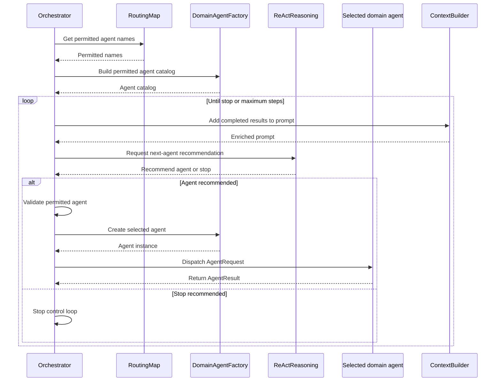

# Lab 3: Reliable Orchestration

## Introduction

An agentic application may need several specialized agents to answer one request. Based on its reasoning, a model can suggest which agent should run next. Because model output is probabilistic, deterministic application code acts as a control gate: it validates the model's proposal against application rules and invokes the agent only when that choice is permitted and available.

In this lab, you will implement the application's deterministic orchestration workflow. `ReActReasoning` uses the model to propose the next domain agent or indicate that processing should stop. The `Orchestrator` validates that proposal against the intent's allow-list, resolves and runs the permitted agent, and collects its typed `AgentResult`. This creates a reliable boundary: the model proposes what might happen next, while deterministic code decides what is allowed to happen.

## Reliable orchestration

### What is reliable orchestration?

Reliable orchestration combines a language model's ability to reason about the next step with application code that validates and executes it. The `ReActReasoning` class asks a language model to recommend which domain agent should run next or whether no more agents are needed. It returns the proposed agent, confidence score, and explanation in a validated `ReActDecision` object.

> **Keep in mind:** A language model can understand and generate text, but it cannot execute code or take actions on its own.

The `process_request_stream()` method in the `Orchestrator` class owns the deterministic control loop. The `Orchestrator` passes a list of permitted agent names to the `ReActReasoning` class. The class returns a `ReActDecision` that recommends one of those agents or indicates that processing should stop.

The loop ends when no additional agent is needed, an agent provides no new information, or the maximum number of steps is reached.

### Why reliable orchestration matters

A model's recommendation is probabilistic and should not be treated as permission to execute code. The `Orchestrator` acts as the deterministic control gate: it restricts which agents may be selected, validates the model's proposal, and controls when execution stops.

> The model recommends the next step. The `Orchestrator` decides whether that step is allowed and executes it.

## Architecture context

Reliable orchestration is the controlled sequence between intent classification and response composition. The `Orchestrator` controls each step while `ReActReasoning` recommends which permitted domain agent should run next:

### Component relationships

The highlighted components show where probabilistic reasoning meets deterministic control. `ReActReasoning` proposes the next agent, while the `Orchestrator` owns the reason-dispatch-observe loop and executes only validated choices.


### Orchestration sequence

The following sequence traces one pass through the control loop, from preparing the permitted agent catalog to reasoning, validation, dispatch, and observation.



### Reliable orchestration components

| Component            | Responsibility                                                                                    |
| -------------------- | ------------------------------------------------------------------------------------------------- |
| `Orchestrator`       | Owns the deterministic control loop, validates decisions, dispatches agents, and stops execution. |
| `ReActReasoning`     | Recommends the next permitted agent or indicates that processing should stop.                     |
| `RoutingMap`         | Returns the agent names permitted for the classified intent.                                      |
| `DomainAgentFactory` | Builds the permitted agent catalog and creates the selected agent.                                |
| `ContextBuilder`     | Adds completed `AgentResult` data to the next reasoning prompt.                                   |

## Lab exercise

### Learning objectives

By the end of this exercise you will be able to keep model recommendations separate from application-controlled execution, enforce an intent allow-list before dispatch, and pass typed objects between the `Orchestrator` and its agents.

### What is already provided

- Intent classification, with the `UNKNOWN` and `ERROR` short-circuit.
- The authorized agent allow-list and catalog.
- The `MAX_STEPS` loop and the enriched prompt.
- Agent-result streaming and duplicate-result stopping.
- Error handling, response assembly, telemetry, and conversation storage.

Open the `Orchestrator` class in `src/app/agents/orchestrator.py`. You will complete the five steps below inside `Orchestrator.process_request_stream()`, between the enriched prompt and the provided result-processing code.

#### Step 1: Request and stream the model recommendation

At this point, you will invoke the `ReActReasoning` agent, passing it the enriched prompt and the catalog of authorized agents for the specific intent. The agent will return its decision.

```python
# Ask the model to recommend the next agent or to stop.
# Each decision carries: next_agent, confidence, reasoning.
decisions = await self._reasoning.reason(enriched_prompt, catalog)

# Send every reasoning decision to the Execution Trace display in the UI.
for step_decision in decisions:
    yield self._stream_events.build(
        "step", self._reasoning.to_trace_step(step_decision, is_first_decision)
    )
```

`ReActReasoning` only proposes the next agent - it cannot run it. That is the job of the `Orchestrator`.

Notice what comes back. Each decision is a typed object carrying `next_agent`, `confidence`, and `reasoning`. That is structured output, not free text. Deterministic code can validate and act on typed fields. It cannot do that reliably with a sentence.

#### Step 2: Select the final decision or stop

The agent can return more than one decision, so you will act on the last one. If it names no next agent, the loop stops.

```python
# Use the final decision to stop or select the next agent.
decision = decisions[-1]

# Stop when the model recommends no next agent.
if decision.next_agent is None:
    break
```

A null `next_agent` means no additional domain agent is needed. Note that the model cannot stop the loop. Deterministic code decides which decision counts, and deterministic code performs the `break`.

#### Step 3: Enforce the intent allow-list

Before anything runs, you will check the recommended agent against the allow-list for the classified intent.

```python
# Reject agents outside the intent's allow-list.
if decision.next_agent not in allowed:
    raise RuntimeError(
        f"Agent is not allowed for this intent: {decision.next_agent}"
    )
```

This is a deterministic gate. The model proposes an agent, but deterministic code decides whether it may run, and no recommendation can expand the agents permitted for this intent. Because the check happens before the agent is created, an unauthorized agent never executes and the request ends here.

#### Step 4: Resolve and announce the permitted agent

Next you will resolve the approved name into a real agent instance and announce the dispatch. `self._factory` is the `DomainAgentFactory`, which knows every domain agent the application supports and builds a fresh one, already wired with its dependencies.

```python
# Get the selected agent; fail if it is not registered.
agent = self._factory.get(decision.next_agent)
if agent is None:
    raise RuntimeError(f"Agent is not available: {decision.next_agent}")

# Announce the agent dispatch in the Execution Trace display in the UI.
yield self._stream_events.build("step", TraceStep(
    agent=decision.next_agent,
    action="dispatch",
    summary=f"Calling {decision.next_agent} agent to fetch data",
))
```

This is the second gate. Passing the allow-list means the agent is authorized, not that it exists, so the factory lookup confirms it is registered. Note also that the model returned only a name. Deterministic code turns that string into the agent instance, so the model never hands the application something executable. The dispatch event then records the approved action before the agent runs.

#### Step 5: Invoke the agent and collect its result

At this point, the reasoning model suggested an agent based on the intent, deterministic code validated the selection, and the agent factory created the instance. Now you will call that agent with a typed request and keep its typed result.

```python
# Call the selected agent with the entities and enriched prompt.
result = await agent.handle(AgentRequest(
    agent=decision.next_agent,
    entities=intent_result.entities,
    user_prompt=enriched_prompt,
))

# Save the result for the next reasoning step and final response.
results.append(result)
```

Both directions are typed. `AgentRequest` is the input contract, and the agent returns an `AgentResult`, which is structured output rather than free text. Deterministic code can read and act on its fields. Note also that the entities come from the validated `IntentResult`, not from the reasoning model, so the agent receives data that was already checked. Each result is appended to `results`, where it becomes evidence for the next reasoning step and input to the final response.

### Coding wrap-up

At this point, you have completed the recommendation, validation, and dispatch portion of the ReAct control loop.

The surrounding provided code bounds the loop with `MAX_STEPS`, streams the agent result, stops when an agent returns duplicate meaningful data, handles failures, and assembles the final response.

> **Note:**
>
> 1. Save your changes.
> 2. Move to the **Test activities** section.

### Test activities

Let's test the orchestration control loop in isolation and confirm that it executes only permitted model recommendations.

Lab 3 includes a predefined unit test class named `TestLab3ReliableOrchestration`, located in `tests/test_lab3_reliable_orchestration.py`. Its three tests follow the outcomes the deterministic control gate must handle:

1. A permitted agent executes, and the next decision stops the loop.
2. A stop decision completes without dispatching an agent.
3. An agent outside the intent's allow-list is rejected.

These tests replace model reasoning and domain agents with controlled responses, so they run consistently without making an Azure OpenAI request or calling a real domain agent.

To keep your focus on orchestration rather than a long pytest command, the repository includes the `test-lab3` script. You can use it to run all three tests together or select one test at a time.

Run all three tests from the repository root:

```bash
./test-lab3
```

The expected summary is `3 passed`.

#### Test 1: Permitted agent executes and the loop stops

**What it does:** Verifies that the `Orchestrator` executes a permitted agent and stops when the next reasoning decision indicates that the request is complete.

**How it works:** The first mocked `ReActDecision` recommends the permitted `asset` agent. That agent returns a typed `AgentResult`. The second decision recommends stopping. The test verifies that the factory resolves `asset`, the agent receives the expected `AgentRequest`, and the stream ends with a final event.

**Command:**

```bash
./test-lab3 -k selects_and_executes
```

**Expected result:** The `asset` agent is created and called once with the original user prompt. The orchestration stream produces a final event, and the test reports `PASSED`.

#### Test 2: Stop decision causes no dispatch

**What it does:** Verifies that the `Orchestrator` does not execute an agent when `ReActReasoning` indicates that no additional work is needed.

**How it works:** The mocked reasoning result returns a `ReActDecision` whose `next_agent` value is null. The test verifies that the factory is never asked to create an agent and that the stream still ends with a final event.

**Command:**

```bash
./test-lab3 -k stops_without_dispatching
```

**Expected result:** No domain agent is created or called. The orchestration stream produces a final event, and the test reports `PASSED`.

#### Test 3: Unauthorized agent is rejected

**What it does:** Verifies that the `Orchestrator` rejects a model recommendation that falls outside the classified intent's allow-list.

**How it works:** The request is classified as `EVENT_RESPONSE`, but the mocked reasoning result recommends the unauthorized `customer` agent. The test verifies that the factory is never asked to create that agent and that the stream reports an error containing `not allowed`.

**Command:**

```bash
./test-lab3 -k rejects_agent_outside
```

**Expected result:** The `customer` agent is not created or called. The orchestration stream produces an error explaining that the agent is not allowed, and the test reports `PASSED`.

After the focused tests pass, submit a supported request. Verify in the Execution Trace that reasoning recommends an agent, the `Orchestrator` dispatches only a permitted agent, and processing ends with a final response.

### Success criteria

You have completed Lab 3 when:

- You have completed the recommendation, validation, and dispatch block in `Orchestrator.process_request_stream()`.
- The provided loop builds the available agent catalog from the classified intent's allow-list.
- `ReActReasoning` recommends the next agent or indicates that processing should stop.
- A stop decision ends the loop without dispatching another agent.
- An agent outside the allow-list is rejected before it can be created or called.
- A permitted agent receives a typed `AgentRequest`, and its `AgentResult` is added to the orchestration results.
- The provided stopping controls still bound the loop with `MAX_STEPS` and stop duplicate meaningful results.
- Running `./test-lab3` reports `3 passed`.
- A supported request shows reasoning, permitted dispatch, and the final response in the Execution Trace.
