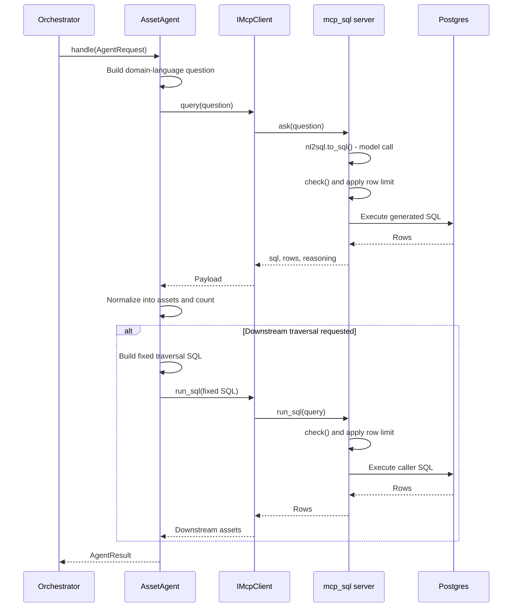

# Lab 4: Build a Domain Agent

## Introduction

As you may have noticed, the Reliable Agents accelerator application with which you're working implements a multi-agent architecture. This architecture spreads work across domain-based specialist agents who have deeper expertise in a specific area, such as Assets, Outages, or Crews. The `Orchestrator` is responsible for determining which domain agent runs. Each domain agent answers for its own specialized area and nothing else.

In this lab you will complete `AssetAgent`, the specialist that resolves grid assets and their topology. It receives a strongly-typed `AgentRequest` object carrying the user's prompt and the entities extracted at classification time, turns that request into a domain-language question, reaches operational data through an injected MCP client, and returns a strongly-typed `AgentResult` object, carrying the agent name, its data payload, a trace step for the Execution Trace, and a success flag.

The domain agent is deliberately narrow. It cannot call another domain agent. It cannot open its own database connection. Every capability it has arrives through one injected interface, which is what makes its behavior predictable and its failures easy to locate, all contributing to a more deterministically architected solution.

## Single agent or multi-agent?

A single-agent design puts every tool and every domain rule behind one model call. It is simpler, it makes fewer round trips, and for a small tool surface it is often the right answer.

The cost appears as the surface grows. The more tools and domain rules a single prompt carries, the more room the model has to choose wrong, and there is no natural place to say "this request may use these capabilities and not those."

A multi-agent design splits the work into specialists and puts a deterministic router in front of them.

|                         | Single agent             | Multi-agent                              |
| ----------------------- | ------------------------ | ---------------------------------------- |
| Tool surface per call   | everything               | only the selected domain                 |
| Authorization           | argued inside one prompt | an allow-list enforced outside the model |
| Model calls per request | one                      | one per step                             |
| Testing                 | end to end               | each specialist in isolation             |
| Failure isolation       | hard to attribute        | the trace names the agent                |

Multi-agent becomes the better strategy when domains carry different data, different rules, and different permissions.

### Why this accelerator is multi-agent

This application answers operational questions about assets, events, outages, crews, reliability, and weather. Two properties of that use case make specialists the better fit.

1.) **The domains do not share a data path.** `AssetAgent` reads through the MCP NL-2-SQL service. `WeatherAgent` calls an external forecast API and the map service, and never touches the database. `OutageAgent` reads through MCP but writes through `OutageLifecycleService` and SQLAlchemy. Folding all of that into one agent would gather every dependency in one place and make each one harder to test in isolation.

2.) **Every intent permits a different subset.** `RoutingMap` grants `EVENT_RESPONSE` five agents, `SITUATIONAL_AWARENESS` two, and `UNKNOWN` none at all. Because the agents are separate, that rule is a dictionary lookup that runs before anything executes. Inside a single agent it would have to be argued to a model in a prompt.

The drawback is real. More specialists mean more model calls, more latency, and more moving parts. The control loop you built in Lab 3 is what keeps that bounded, through `MAX_STEPS`, an explicit stop condition, and a duplicate-result check.

## Learning objectives

By the end of this lab you will be able to:

- Implement a domain agent that receives a typed `AgentRequest` and returns a typed `AgentResult`.
- Build a domain-language question from the user's prompt and the typed entities.
- Reach data through an injected interface rather than a concrete client.
- Choose between model-generated SQL and fixed, hand-written SQL, and explain when each is appropriate.
- Fail a step rather than return a result that looks successful.
- Explain why a domain agent cannot call another domain agent.

## Architecture context


**Red outline: `AssetAgent`.** The agent you will complete, sitting in the domain agent row with its peers. The `Orchestrator` above selects one of them per step. Notice that no arrow connects one domain agent to another.

**Blue box: the data leg.** Every read agent reaches Postgres this way. `AssetAgent` holds an `IMcpClient` and, through it, calls one of two tools the `mcp_sql` server exposes:

| Tool             | Who writes the SQL             | Model involved |
| ---------------- | ------------------------------ | -------------- |
| `ask(question)`  | `nl2sql.to_sql()` generates it | yes            |
| `run_sql(query)` | the caller supplies it         | no             |

Both land on the same guard. `check()` rejects anything that is not a single `SELECT` or `WITH`, and `_with_limit()` caps the row count. Model-generated SQL gets no privileged path.

That guard is fast-fail convenience, not the security boundary. The real boundary is the pgEdge connection at the bottom of the data leg, which holds a read-only grant, `PGEDGE_DB_ALLOW_WRITES=false`, enforced by the database itself and outside anything the model can influence.

**Green box: the deterministic write path.** The orange line reaches it directly from the REST API, bypassing the orchestrator entirely. It belongs to `OutageAgent`, not to the agent you are building, and is out of scope for this lab. `AssetAgent` has no write path of any kind.

### A pluggable data backend

`mcp_sql` is an MCP **server**. It runs as a separate process and exposes the two tools above over HTTP. The application reaches it through `McpClient`, the client side of that boundary.

Agents never see either one. They depend on `IMcpClient`, an application interface with two methods, and `McpClient` is simply the implementation that ships with the accelerator.

That indirection is what makes the data store pluggable. A different backend, whether or not it speaks MCP, needs only its own `IMcpClient` implementation, with no change to any agent. It is also what lets this lab's tests hand the agent a mock and run offline.

### Orchestration sequence

The following sequence traces one call to `AssetAgent.handle()`, from the orchestrator's dispatch to the typed result it returns.



Four things are worth noticing.

**The model appears once, inside the server.** `nl2sql.to_sql()` is the only probabilistic step in the sequence. Everything before it assembles a question, and everything after it is validation, execution, and normalization.

**Both SQL sources pass the same guard.** Whether the SQL came from the model or from the agent's own hand-written traversal query, `check()` and the row limit run before the database sees it.

**The optional branch is not a new model decision.** It runs only when the intent classifier already set `needs_downstream_assets`, decided once before the ReAct loop began. The traversal SQL is hand-written, so the same asset returns the same rows every time.

**The agent's only outbound arrow is to `IMcpClient`.** There is no line from `AssetAgent` to another domain agent, because there is nothing in the class to draw one with.

#### What `needs_downstream_assets` means

Grid assets form a hierarchy: substation, then feeder, then transformer, then service location, then meter. A question like "what is affected by the outage at FDR-204?" asks for everything below that asset in the hierarchy, not for the asset itself.

`needs_downstream_assets` is a boolean the intent classifier sets when it recognizes that framing. It is one model judgment made once per turn, not a decision re-made on every ReAct step.

The traversal it triggers uses hand-written SQL rather than a generated query, and the reason is worth reading carefully. When this traversal was left to NL-2-SQL, the model performed the joins on some calls and skipped them on others, so identical questions returned different answers from one run to the next. The fix was not a better prompt. It was moving the traversal out of the model's hands entirely.

That is this workshop's thesis in a single feature: one model judgment, then fixed code.

## Lab exercise

You will complete `AssetAgent`'s model-generated read path, from prompt construction through typed result creation.

### What is already provided

- `AgentRequest`, `AgentResult`, `Entities`, and `TraceStep`.
- `BaseDomainAgent`, including the typed `handle()` contract.
- `IMcpClient`, with `query()` for domain-language questions and `run_sql()` for fixed read-only SQL.
- Dependency injection of `IMcpClient` through the `AssetAgent` constructor.
- The fixed downstream traversal branch and its hand-written SQL.
- Logging, the result helper, and orchestration-level error handling.

Open `src/app/agents/asset_agent.py`. You will complete the five steps below in `AssetAgent`.

#### Step 1: Build the domain-language question

Start in `_build_prompt()`. Read the typed entity slots from the request and convert the populated asset fields into domain terms.

```python
e = request.entities
filters: list[str] = []

if e.asset_id:
    filters.append(f"asset {e.asset_id}")
if e.feeder:
    filters.append(f"feeder {e.feeder}")
if e.substation:
    filters.append(f"substation {e.substation}")
if e.location:
    filters.append(f"location {e.location}")
```

These are domain labels, not table names or column names. The agent says what it needs; the NL-2-SQL service owns how that request maps to the database.

Now preserve the user's complete request and add the extracted scope when one exists:

```python
question = f"Answer the asset portion of this request: {request.user_prompt}"
if filters:
    question += (
        f" Scope the query starting from: {', '.join(filters)}. If the request asks "
        "about assets affected, impacted, or downstream of that starting point (e.g. "
        "due to an outage), that starting asset is the ROOT of the traversal, not an "
        "exact-match filter - include it and everything downstream of it. Only treat "
        "it as an exact-match filter (return just that one asset) when the request is "
        "asking about the asset itself with no affected/impacted/downstream framing."
    )
```

Leave the provided fixed-schema reference that follows this block in place, then return `question`. That reference describes allowed domain values; it does not inspect live rows or choose a query plan.

The original user wording matters. Reducing the prompt to a generic request such as "return assets" would discard constraints such as time windows, counts, inspection state, or exclusions that were not promoted into entity slots.

#### Step 2: Invoke the injected MCP client

Return to `handle()`. Build the question, log it, and pass it to the injected interface:

```python
prompt = self._build_prompt(request)
logging.info("AssetAgent: reasoning (question)=%s", prompt)

try:
    payload = await self._mcp.query(prompt)
except Exception:
    logging.exception("AssetAgent: MCP query failed; failing the step")
    raise
```

The agent does not construct `McpClient` and does not open a database connection. It knows only the `IMcpClient` contract supplied to its constructor.

The `raise` is equally important. An MCP failure is not an empty successful result. Re-raising lets the orchestrator emit an error event and stop instead of composing an answer from missing evidence.

#### Step 3: Normalize the MCP payload

Complete `_parse()` so the rest of the application sees one stable asset shape even when the backend returns its rows directly or wraps them in a dictionary:

```python
if isinstance(payload, list):
    assets = payload
elif isinstance(payload, dict):
    assets = payload.get("rows") or payload.get("assets") or []
else:
    assets = []

return {"assets": assets, "count": len(assets)}
```

This is normalization, not error recovery. Transport and tool failures were already raised in Step 2. `_parse()` handles only the successful payload shapes supported by the agent.

#### Step 4: Preserve tool evidence

After calling `_parse()`, attach the generated SQL, original MCP question, and server reasoning to the result data:

```python
data = self._parse(payload)
sql = payload.get("sql") if isinstance(payload, dict) else None
reasoning = payload.get("reasoning") if isinstance(payload, dict) else None
data["sql"] = sql
data["question"] = prompt
data["reasoning"] = reasoning
logging.info("AssetAgent: rows=%d sql=%s", data["count"], sql)
```

These values make the data leg inspectable without asking the model to explain itself again. The generated SQL remains evidence returned by the tool; the domain agent does not execute or rewrite it.

Leave the provided downstream traversal block immediately after this code. It is a separate deterministic operation triggered by the typed `needs_downstream_assets` flag.

#### Step 5: Return a typed result and trace step

Finish `handle()` by using the provided `_result()` helper:

```python
return self._result(
    data=data,
    ok=True,
    summary=f"resolved assets ({self._describe(request)}); {data['count']} found",
    detail={
        "question": prompt,
        "tool": "ask",
        "sql": sql or "",
        "reasoning": reasoning or "",
        "rows": str(data["count"]),
    },
)
```

`_result()` constructs the `AgentResult` and its `TraceStep`. The return value is therefore validated at the agent boundary, and the orchestrator receives structured evidence rather than a prose answer.

### Coding wrap-up

You have completed the domain-agent read path. The agent turns typed context into a domain question, calls one injected capability, normalizes successful output, preserves tool evidence, and returns a validated result. It does not select another agent, create a data connection, or render the final user response.

> **Note:**
>
> 1. Save your changes.
> 2. Move to the **Test activities** section.

## Test activities

Let's test `AssetAgent` in isolation and confirm that it preserves the user's request, returns typed evidence, propagates failures, and runs deterministic traversal only when the classified request requires it.

A set of predefined tests can be found in `tests/test_asset_agent.py`, in the class `TestAssetAgent`. They cover six responsibilities of a reliable domain agent:

1. Preserve the complete user request and MCP evidence.
2. Add typed asset scope to the domain-language question.
3. Return a validated `AgentResult` and `TraceStep`.
4. Propagate an MCP failure instead of returning false success.
5. Execute fixed downstream traversal when the classifier requests it.
6. Skip downstream traversal when the classifier does not request it.

`IMcpClient` is replaced with controlled mocks, so no MCP server, model, or database is required. The tests run offline and produce the same result every time.

The repository includes a `test-lab4` script so you can skip the longer pytest command. Run all six tests from the repository root:

```bash
./test-lab4
```

Expect `6 passed`.

#### Test 1: The user request and MCP evidence are preserved

**How it works:** The mocked MCP client returns one aggregate row together with generated SQL and reasoning. The test confirms that the agent sends the user's complete request to MCP and preserves the returned rows, SQL, question, and reasoning in `AgentResult.data`.

```bash
./test-lab4 -k preserves_user_request
```

**Expected result:** The complete user request appears in the MCP question, all returned evidence appears in `AgentResult.data`, and the test reports `PASSED`.

#### Test 2: Typed entity scope is added to the question

**How it works:** The test constructs an `AgentRequest` containing asset, feeder, substation, and location entities, then calls `_build_prompt()` directly. This isolates deterministic prompt construction without invoking MCP.

```bash
./test-lab4 -k appends_typed_asset_filters
```

**Expected result:** The generated question preserves the user's request and adds the asset, feeder, substation, and location extracted during intent classification. The test reports `PASSED`.

#### Test 3: The agent returns a typed result and trace

**How it works:** The mocked MCP client returns one asset row. The test confirms that `handle()` normalizes the row and returns a successful `AgentResult` containing a `resolve_asset` trace step.

```bash
./test-lab4 -k returns_typed_result
```

**Expected result:** The result identifies the `asset` agent, reports one normalized row, and includes a successful `resolve_asset` trace step. The test reports `PASSED`.

#### Test 4: MCP failure propagates

**How it works:** The mocked MCP client's `query()` method raises `RuntimeError`. The test confirms that `AssetAgent` re-raises the exception rather than converting the failure into an empty successful result.

```bash
./test-lab4 -k propagates_mcp_failure
```

**Expected result:** The `MCP unavailable` exception escapes `AssetAgent.handle()`, and the test reports `PASSED`.

#### Test 5: Classified downstream scope uses fixed SQL

**How it works:** The request contains an asset identifier and sets `needs_downstream_assets=True`. The normal MCP query returns the initial asset result, and the mocked `run_sql()` call returns the downstream rows. The test verifies that the fixed traversal query checks the named asset at the substation, feeder, and transformer levels.

```bash
./test-lab4 -k runs_fixed_downstream_query
```

**Expected result:** The agent calls `run_sql()` with the fixed traversal query and adds the returned rows to `AgentResult.data["downstream_assets"]`. The test reports `PASSED`.

#### Test 6: Downstream traversal requires the classifier flag

**How it works:** The request contains an asset identifier but leaves `needs_downstream_assets=False`. The test confirms that an asset identifier alone does not authorize the additional traversal.

```bash
./test-lab4 -k skips_downstream_query
```

**Expected result:** The agent does not call `run_sql()` and does not add `downstream_assets` to the result. The test reports `PASSED`.

Together, these last two tests capture the deterministic boundary: the classifier makes the traversal judgment once, and fixed code either executes or skips the traversal from that typed decision.

With all six tests passing, start the application and submit an asset question such as:

```text
How many transformers were inspected in the last 30 days, excluding retired assets?
```

In the Execution Trace, confirm that the orchestrator dispatches `asset`, the agent records the MCP question and generated SQL, and the final response uses the returned evidence.
